# 数据库故障预测的机器学习方法

İsmet Karakurt, Sertay Özer, Taner Ulusinan, Murat Can Ganiz

ExperTeam, R&D Center

马尔马拉大学计算机工程系

伊斯坦布尔，土耳其

{ismet.karakurt, sertay.ozer, taner.ulusinan}@experteam.com.tr, murat.ganiz@marmara.edu.tr

**摘要** - 在本研究中，我们应用机器学习算法来预测Oracle数据库和相关服务中可能遇到的技术故障。 为了训练机器学习算法，每小时从Oracle数据库系统收集日志文件中的数据并标记为两个类; 正常或异常。 我们使用多种数据科学方法对输入数据进行预处理并将其从原始格式转换为可以提供给算法的格式。 在预处理之后，在我们的数据集上训练和评估几个不同的机器学习分类器。 我们的结果表明，使用有监督的机器学习算法，特别是随机森林算法，可以预测导致失败的警告（即异常事件），具有相对令人满意的召回率（75.7％）和精确率（84.9％），这明显高于其他分类器。
**关键词 - 机器学习; 数据科学; oracle数据库;故障预测;**

## Ⅰ.引言

​	用于检测或更好地预测关系数据库管理系统的预警系统非常重要，因为诸如财务等广泛业务中的许多关键过程和软件高度依赖于这些系统。特别是那些为大规模公司提供数据库管理和咨询解决方案的公司对此类故障的容忍度最低。由于它的重要性，我们开发和评估了一个基于机器学习的预测系统，它通过在数据科学技术和人工智能的基础上查看其日志文件来预测数据库故障[1,2]。该系统是与这样一家公司合作设计的：ExperTeam（Uzman Bilişim Danışmanlık A.Ş。） 它是“Oracle业务合作伙伴”和我们实验的主要数据提供者。考虑到在每一次故障情况下用于恢复的资源，事先预测这些故障肯定有助于公司节省时间，精力和金钱。保持这些数据库系统运行是非常重要的，通过及早发现故障并防止它们发生。

​	机器学习算法被广泛用于异常检测，并且在不同的领域仍然具有重要作用[1,2]。 但是，异常检测的大部分工作都集中在数据库中的网络攻击或互联网流量，注册表异常，入侵或恶意行为检测中的其他异常[3,4,5,6,7,8,9 ，10,11,12]。 在关系数据库管理系统（RDMS）上预测基于系统的故障，关注特定的RDBMS似乎是一个很少研究的主题，如果有的话。

​	为机器学习算法准备相关数据主要包括两个挑战。第一种方法是从几个RDMS收集日志数据并将其传送到中央预测服务器，这些RDMS可以安装在防火墙后面的不同物理位置。第二个挑战是预处理，从Oracle RDBMS和相关服务收集的每小时日志数据。数据必须尽可能干净且无噪音，以便产生更好的预测结果，尤其是在有监督的机器学习算法中。下面几种情况的存在导致分类输出不良。在现实生活中，无法获得纯净的数据，可能存在不希望的异常值，错误标记的实例，缺失的信息，不相关的特征等[7,10]。因此，许多研究人员还致力于使用不同方法处理噪声数据，例如聚类方法，学习概率分布和无监督机器学习算法，这些算法基于异常值检测的[5,6,7,8,10]。数据预处理阶段是数据科学中最重要的阶段之一。数据科学技术在这一部分派上用场，帮助我们让数据对学习算法更有用。此外，从ExperTeam自己的数据库获得的真实数据在类标签方面可以被认为是干净的，因为在这个问题领域中，警告和关键条件会导致系统产生系统故障。它们不是手动标记的。通过对数据进行一些额外的清理和转换工作和适当的特征选择技术，我们使数据准备好应用机器学习算法。

​	特征选择方法有助于降低维度和疑似噪声特征的数量，并且通常有助于提高机器学习算法的性能[2]。 在这方面，我们首先使用python [14]中的sklearn（scikit-learn）库中的SelectKBest方法，该方法从特征集中选择最相关的特征。 另外，我们实现了基于信息增益（IG）[15]的特征选择方法。 我们观察到特征选择改善了我们实验中的分类结果。

​	我们的研究中使用了不同的机器学习算法。 我们在这个项目中使用的学习算法包括Support Vector Machines （支持向量机）[16]，Naïve Bayes（朴素贝叶斯）[17]，Logistic Regression（逻辑回归）[18]，Random Forest （随机森林）[19]和Adaptive Boosting（AdaBoost） [20]。 我们使用10倍交叉验证方法对这些分类算法进行了许多实验，以估计它们对看不见的数据的性能并避免过拟合。

## Ⅱ.相关工作

​	文献中关于入侵/异常检测有许多研究。 该主题自20世纪90年代初开始引起关注。 从那时起，针对各种主题实施了不同的异常检测方法，如网络攻击检测[3]，互联网骨干网流量异常检测[4]，网络环境中的入侵检测[5]，Windows注册表中的异常检测[6] 和更多。 在这些研究中，机器学习算法被广泛使用。 机器学习算法的使用优于传统的基于签名的系统，因为它们被认为是构建和更新很费力[3,4,5,6]。 我们遇到的大多数研究都是在不完整和嘈杂的数据上进行的，因为干净的数据几乎没有而且非常昂贵。

​	埃斯金等人[13]提出了一种使用未标记数据无监督方法的异常检测算法，假设正常实例的数量明显大于异常实例的数量。 肖恩等人[3]提出了一种增强的SVM算法，该算法将监督的SVM与one-class SVM相结合，以便检测互联网流量中的零日网络攻击。他们试图利用高性能的监督算法和大量未标记的数据用于无监督算法。瑞恩等人 [4]使用基于神经网络的机器学习算法来检测入侵，学习过程通过使用用户留在系统上的痕迹（例如命令使用记录）来进行。 Portnoy等人[5]在另一方面，使用聚类方法来检测网络中的入侵，他们认为基于签名的检测方法在检测新类型的入侵方面效率不高。而且，由于难以标记非常大的数据集，他们坚持使用无监督算法*，例如lustering methods over supervised approaches*。

​	胡等人 [7]提出了新的SVM方法，他们称之为鲁棒SVM来处理噪声数据。 在他们的论文中，他们提到大多数方法都是假设训练样本是可信的和没有污染的，基于这种情况几乎不存在的事实，他们继续采用这种方法。

​	与这些研究不同，我们将机器学习算法应用于相对较少研究的预测RDBMS中故障的主题。 此外，我们应用了许多机器学习算法，因为算法的结果大多是不可预测的，并且应该基于实验选择特定域中的最佳性能算法，这也被称为机器学习领域的没有免费午餐定理。 此外，我们还认为数据预处理和特征选择方法与机器学习算法的选择同样重要。 在这方面，我们付出了额外的努力。

## Ⅲ.方法

​	我们的数据包括170天内每小时从几台不同服务器收集的日志。结果，我们总共有38,184小时的观察结果。*数据中的每一行对应于若干性能指标计算结果的一小时。*特别是，我们有各种各样的指标，与我们的数据集表中的列相对应。我们总共有261列。除了这些261指标之外，我们还有“target id”，用于标识收集数据的Oracle数据库或系统，“time stamp”显示收集数据的日期时间，“output”基本定义类标签。这261个特征涵盖了尽可能多的不同的oracle服务，包括核心RDBMS。结果，在特定时刻，他们数量稀少。还可以访问有关这些统计信息的详细信息，以告知我们其目标类型，度量标准名称和度量标准类型。例如，具有“A”代码的功能可能表示从目标“oracle_listener”的度量“响应”记录的值，其中度量列为“tnsPing”。 'target_id'表示记录发生的目标系统，'time_stamp'表示发生时间，'output'表示记录的标签标签，可以是'0'或'1'，对应'正常'或'异常'类别。在某些情况下，数据库或相关服务会产生导致故障的警告，产生这些警告的每小时日志标记为异常。

​        *如上所述，有不同的目标。 目标是指端点的位置。 由于公司为其他公司提供不同用途的解决方案，因此公司有不同的终点来收集数据。 我们预测独立于目标的警告情况。*

​	异常实例的数量是此分类模型的重要参数。换句话说，与其他异常检测问题非常相似，我们的数据中存在极度偏斜的类别分布，其中异常实例仅占整个数据的很小一部分。为了能够训练有监督的机器学习算法，例如分类器，异常实例的数量应该以某种方式增加。否则，分类算法可能不会学习*区分或辨别*正常类和异常类，结果就是，算法将每个未来的实例分类为正常，即绝大多数类。这是应用监督算法进行异常检测的关键问题之一。为了避免这种情况，我们采用了几种基本的预处理方法。例如，我们通过采样或使用过采样来减少正常实例的数量，方法是添加更多的少数类，即异常实例。这样，我们就拥有了具有不同类值分布的各种数据集。

​	数据的原始类别分布向我们表明异常情况很少出现。 在38,184行中，我们只有1,216个异常实例。 图1中的饼图显示了这种情况。 导致异常情况的警告百分比在数据集中约为3％。

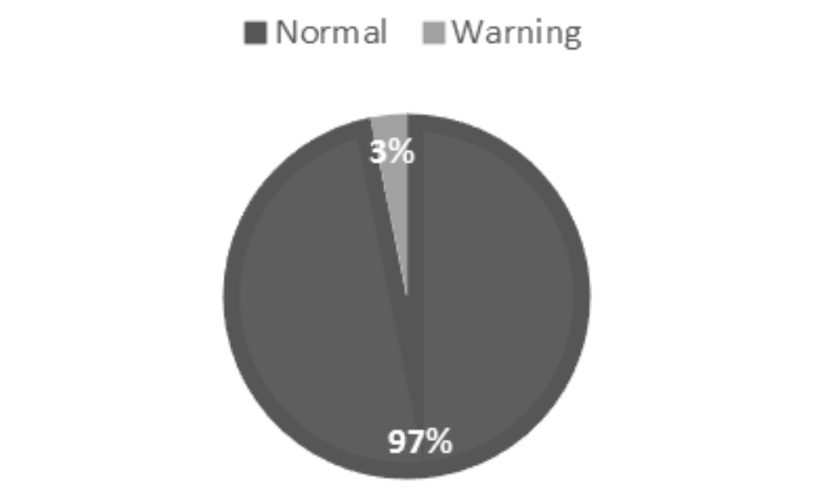

​                                                                          图1：数据集中的类别分布

​	如上所述，我们的数据集中的261个特征中的每个特征代表不同的目标和度量组合。 表I显示了信息增益（IG）选择的前20个特征的这些组合。

​                                                                 表I.信息增益选择的前20个特征

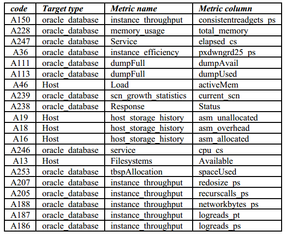

​	除此之外，表II还列出了这些功能的基本统计数据。

​                                                       表Ⅱ. 前20个特征的基本情况

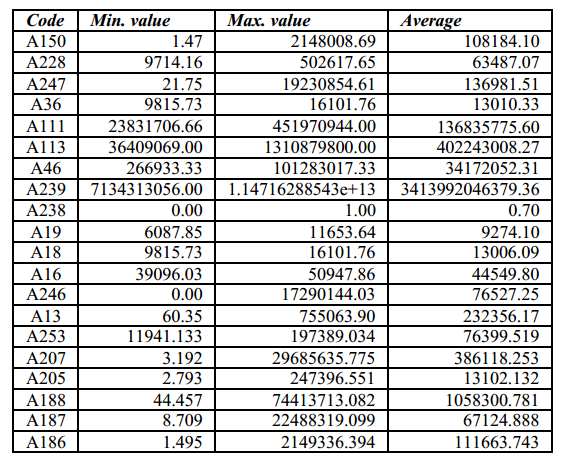

​	我们可以在'表II'中看到对应于特征的值具有各种数值范围。 在这种情况下，对数据进行标准化被认为对改进分类结果是有效的[21]。 此外，考虑到输出值仅为“0”和“1”，将数据放在相同的比例上可以简化在特征和输出值之间找到关系的操作。 此外，在二进制判别算法（如SVM）中，使用标准化数据可以更轻松地从训练数据中创建特征空间[16]。 标准化将降低此类算法的运行时间。 出于这些目的，我们使用在python中的sklearn（scikit-learn）库的预处理库中找到的规范化方法。 我们将属性值标准化为0到1。

​	在特征选择部分中，使用香农信息论[15]来计算信息增益（IG）值。 选择具有较高IG值的特征。 在该理论中，针对类别特征计算Info（D）。 之后，对于数据中的每个特征计算Info A（D）值。特征的IG值等于Info（D）和Info A（D）值之间的差值。

​	对于类别特征，进行以下计算;

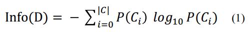

​	C i : 在数据中出现的类别。

​	除了类别特征外，还对数据中的每个特征进行了以下计算;

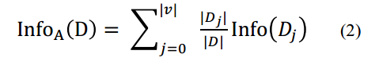

​	V：所选特征中出现的不同次数

​	D j：所选特征中相同事件的子集

​	D：数据大小

​	下面的公式给出了特征“A”的信息增益值：

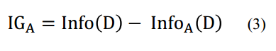

​	下图显示了特征的信息增益（IG）曲线。 “y”轴显示信息增益值，“x”轴显示特征数。

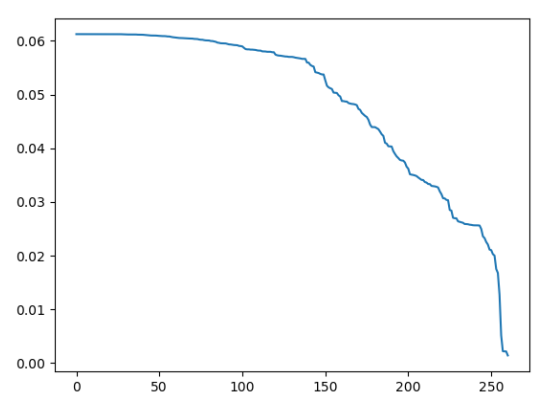

​										图2：特征的IG值

​	表III显示了使用其IG值排序的前40个特征的信息增益值。

​										表III.前40个特征的IG值

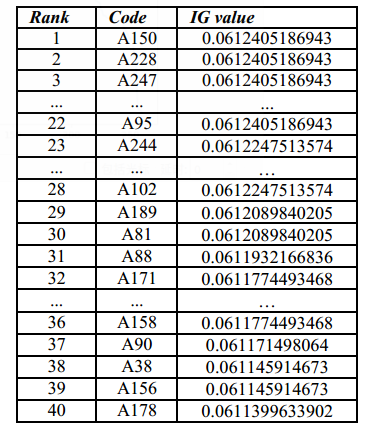

​	这些值向我们展示了这两个类别之间的特征区别。 简单地使用不同类别中的差值来计算IG。 例如，如果特征的某个值只有单个类出现，或者其中一个类别的数量非常高，并且这种情况与其余值相似，则此特征的IG值将很高。 在我们的实验中，我们根据图2中的IG曲线选择了不同数量的特征，并检查了它们对结果的影响。

## Ⅳ.实验设置

​	我们用于分类的算法是来自Python编程语言的scikit-learn库的支持向量机（SVM），逻辑回归（LR），多项式朴素贝叶斯（多项式NB），随机森林（RF）和自适应增强（AdaBoost）。

​	RF和AdaBoost需要几个参数。 在scikit-learn库中编程的默认参数用于这些算法。 表IV显示了这些参数。

​										表IV. 算法和参数设置

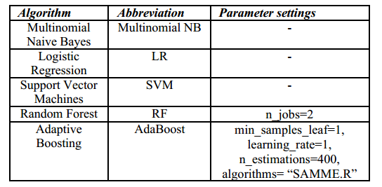

​	创建了三个不同的实验计划。 第一个实验计划使用整个数据进行训练和测试算法。 在第二个实验中，通过使用scikit-learn test_train_split [22]函数来分割整个数据为90％测试和10％训练数据。 在第三个实验中，使用10倍交叉验证（10倍CV）来创建训练和测试数据。

​	另外，使用五种不同的正常和警告类分布。 首先，异常实例使用过采样的方法来使得数量加倍，并且分别从原始数据集采样的正常实例的1000,5000,10000,20000和30000形成我们的数据集。

​	我们使用'select_k_best'和信息增益（IG）方法进行特征选择。 在前两个实验设置中，根据IG值选择前40个特征，因为与k-best方法相比，IG导致更好的分类结果。 在第三个实验设置中，IG曲线中的第一个*击穿点*（图2）用于确定特征的数量。 第一个可见的击穿点是在第99个特征之后。 因此，实验中使用了前99个特征。

​	数据集中存在缺失值（NaN值）。 我们使用文献中推荐的两种不同方法来填补缺失值[23]。 首先，我们使用数据中不存在的异常值来填充缺失值。 在我们的例子中，这个值是'-10000'。 其次，我们使用每个特征的平均值来填充缺失值。 在我们的实验中，我们发现第二种方法在大多数情况下效果更好。

​	我们在研究中使用了几个评估指标：准确率（Accuracy），f-measure（F1），精确率（Precision）和召回率（Recall）。 准确率是真实预测的百分比。 F1得分是Precision和Recall的调和平均值。 F1通常比准确率更有用，特别是当我们是有偏差的类别分布时。 精确率告诉我们对于某个类别有多少预测是正确的。 另一方面，Recall告诉我们在测试集（testset）中正确预测了多少个特定类别的实例。

## Ⅴ. 结果

​	所有算法都在每个实验设置中运行。 您可以在表V中看到针对训练数据设置的测试的评估结果。从AdaBoost结果可以看出，我们可以怀疑过拟合。

​									表V.通过训练集测试对算法的评估

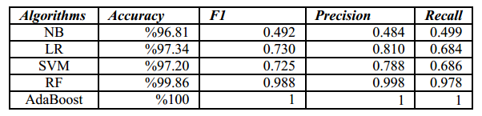

​	在第二个实验设置中，我们将训练集和测试集分开，仅使用10％的数据作为训练集，其余部分作为测试集。 因此，结果比第一种设置更真实，如表VI所示。 尽管结果非常接近，即差异小于1％，但随机森林（RF）算法在准确率和F1得分方面优于其他算法。

​									表Ⅵ. 10％训练集和90％测试集

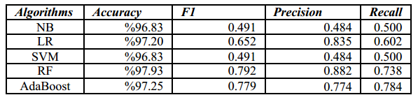

​	这些结果显示了正常和警告类别的宏观平均F1，精确率和召回率。 但是，由于异常检测问题的性质及其高度倾向的类别分布，查看这些类别平均指标可能会产生误导。 实际上，在我们的案例中要注意的重要指标是F1分数或异常类的召回值，因为我们试图预测异常情况，也就是失败的情况。

​	10倍交叉验证方法在这方面为我们提供了更有意义的结果。 交叉验证是一种更好的方法，可以检测模型是否过度拟合，以及更好的预测现实世界的性能。 如实验设置部分所述，将10倍CV方法应用于原始数据和具有不同大小的五个数据集。

​	根据第三个实验的结果，对于我们研究的数据，最好的三种算法是RF，AdaBoost和LR。 在这个实验设置中，我们使用了不同的数据集，因为整体类别分布存在问题。 此外，我们使用IG将特征数量减少到99。 对前两个实验设计的另一个改进是使用平均值来填充数据中的空值。

​	表VII显示了具有异常类别的精确率和召回率的原始数据的总体结果。

​						表VII. 10倍CV - 对于异常类别的整体结果、精确率和召回率

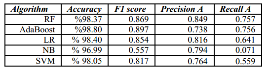

​	通过随机森林（RF）算法实现异常类别的最佳召回率（0.757）和精确率（0.849），该算法明显高于其他算法。
	在剩下的实验中，我们使用上一节中描述的设置来平衡类别分布。

​							表VIII. 10倍 CV - ADABOOST结果 增加了正常类别的实例

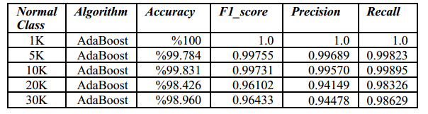

​	从表VIII可以看出，由于增加了正常类别的数量，类别分布出现了偏差，导致性能指标略微降低。 相同的趋势也出现在表IX中的LR算法、表X中的NB算法和表XI中的SVM算法。

​									表IX.10倍 CV - LR的结果

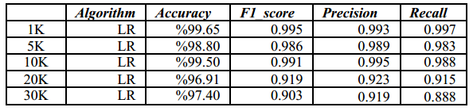

​									表X. 10倍CV - 多项式NB的结果

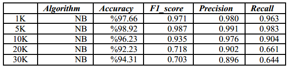

​										表XI. 10倍 CV - SVM的结果

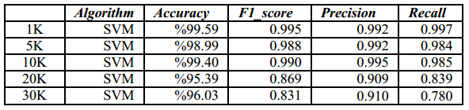

​	SVM是与我们类似的异常检测问题最常选择和使用的算法之一。 但是，SVM的解决方案并不像RF和AdaBoost在本研究中的解决方案那么好。 在具有30K正常实例的数据集中，对于通过SVM算法学习的模型，异常类别的召回率仅为0.569。

## Ⅵ. 结论和未来的工作

​	用于检测或预测关系数据库管理系统（RDBMS）中故障的预警系统是很重要的，因为广泛的业务中的许多关键过程和软件高度依赖于它。 对于某些公司来说，这些故障的成本特别高，例如ExperTeam（Uzman Bilişim Danışmanlık A.Ş。），它为许多大规模的公司提供数据库管理和咨询服务。 基于RDBMS和相关系统的日志，及早发现这些故障非常重要。 因此，我们进行了广泛的实验，开发基于机器学习的故障预测系统。考虑到在每一次故障情况下用于恢复的资源，事先预测这些故障肯定有助于公司节省时间，精力和金钱。

​	我们使用多种数据科学方法对输入数据进行预处理和转换，从原始格式转换为可以提供给算法的格式。 在预处理之后，对我们的数据集进行了广泛的训练和评估。 我们的结果表明，使用有监督的机器学习算法，特别是随机森林算法，具有相对令人满意的召回率（75.7％）和精确率（84.9％），来预测导致故障（即异常事件）的警告，明显高于其他分类器。

​	在未来的工作中，我们计划将基于时间序列的回归和预测方法纳入问题。 此外，我们计划通过使用时间累积功能来改进结果。

## 致谢

​	ExperTeam是Uzman Bilişim A.Ş的商标。 这项工作的初始部分是作为项目工作完成的，在马尔马拉大学计算机工程系的数据科学和大数据分析课程的介绍范围内，由四名学生组成; İsmet Karakurt，Ahmet Kaya，Soner Güzeloğlu和Mehmethan Gür。 作者要感谢匿名审稿人的宝贵反馈。

## 参考文献

[1] Chandola, V., Banerjee, A., and Kumar, V. 2009. Anomaly detection: A survey. ACM Comput. Surv. 41, 3, Article 15 (July 2009), 58 pages. DOI = 10.1145/1541880.1541882 , http://doi.acm.org/10.1145/1541880.1541882

[2] Tsai, C. F., Hsu, Y. F., Lin, C. Y., & Lin, W. Y. (2009). Intrusion detection by machine learning: A review. Expert Systems with Applications, 36(10), 11994-12000.

[3] Shon, T., & Moon, J. (2007). A hybrid machine learning approach to network anomaly detection. Information Sciences, 177(18), 3799-3821.

[4] de Urbina Cazenave, I. O., Köşlük, E., & Ganiz, M. C. (2011, June). An anomaly detection framework for BGP. In Innovations in Intelligent Systems and Applications (INISTA), 2011 International Symposium on (pp. 107-111). IEEE.

[5] Portnoy, L., Eskin, E., & Stolfo, S. (2001). Intrusion detection with unlabeled data using clustering. In In Proceedings of ACM CSS Workshop on Data Mining Applied to Security (DMSA-2001.

[6] Heller, K. A., Svore, K. M., Keromytis, A. D., & Stolfo, S. J. (2003, November). One class support vector machines for detecting anomalous windows registry accesses. In Proc. of the workshop on Data Mining for Computer Security (Vol. 9).

[7] Hu, W., Liao, Y., & Vemuri, V. R. (2003, June). Robust Support Vector Machines for Anomaly Detection in Computer Security. In ICMLA (pp. 168-174).

[8] Hu, Y., & Panda, B. (2004, March). A data mining approach for database intrusion detection. In Proceedings of the 2004 ACM symposium on Applied computing (pp. 711-716). ACM.

[9] Sinclair, C., Pierce, L., & Matzner, S. (1999). An application of machine learning to network intrusion detection. In Computer Security Applications Conference, 1999.(ACSAC'99) Proceedings. 15th Annual (pp. 371-377). IEEE.

[10] Eskin, E. (2000). Anomaly detection over noisy data using learned probability distributions. In In Proceedings of the International Conference on Machine Learning.

[11] Lane, T., & Brodley, C. E. (1997, February). An application of machine learning to anomaly detection. In Proceedings of the 20th National Information Systems Security Conference (Vol. 377, pp. 366-380). Baltimore, USA.

[12] Kamra, A., Terzi, E., & Bertino, E. (2008). Detecting anomalous access patterns in relational databases. The VLDB Journal—The International Journal on Very Large Data Bases, 17(5), 1063-1077.

[13] Eskin, E., Arnold, A., Prerau, M., Portnoy, L., & Stolfo, S. (2002). A geometric framework for unsupervised anomaly detection: Detecting intrusions in unlabeled data. Applications of data mining in computer security, 6, 77-102.

[14] Scikit-learn library in python (da:2017,June 29) Retrieved from: http://scikit-learn.org/stable/index.html

[15] Jaynes, E. T. (1957). Information theory and statistical mechanics. Physical review, 106(4), 620.

[16] C.C. Chang and C.J. Lin, LIBSVM : a library for support vector machines, 2001.

[17] G. H. John and P. Langley. "Estimating continuous distributions in Bayesian classifiers," in Eleventh Conference on Uncertainty in Artificial Intelligence, San Mateo, pp. 338-345, 1995.

[18] Hosmer Jr, D. W., Lemeshow, S., & Sturdivant, R. X. (2013). Applied logistic regression (Vol. 398). John Wiley & Sons.

[19] Breiman, Leo. "Random forests." Machine learning 45.1 (2001): 5-32.

[20] Schapire, R. E. (1999, July). A brief introduction to boosting. In Ijcai (Vol. 99, pp. 1401-1406).

[21] Witten, I. H., Frank, E., Hall, M. A., & Pal, C. J. (2016). Data Mining: Practical machine learning tools and techniques. Morgan Kaufmann.

[22] “train_test_split()” method from sklearn library (da:2017,June 29) Retrieved from : http://scikit-learn.org/stable/modules/generated/sklearn.model_selection.train_test_split.html

[23] Pigott, T. D. (2009). Handling missing data. The handbook of research synthesis and meta-analysis, 2, 399-416.

