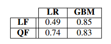

2016年第16届IEEE / ACM国际集群，云计算和网格计算研讨会

# 云NoSQL数据库性能建模的机器学习方法

Victor A. E. Farias, Flavio R. C. Sousa, Jos ´ e G. R. Maia, Jo ´ ao P. P. Gomes, Javam C. Machado

计算机科学系

塞阿拉联邦大学

巴西福塔莱萨

{victorfarias, flavio, gilvan, jpaulo, javam}@lia.ufc.br

***摘要：*云计算是一种成功的新兴范例，支持按需付费的模式。 随着数据的指数级增长，NoSQL数据库已被用于管理云中的数据。 在这些新出现的设置中，保证服务质量的机制在很大程度上依赖于性能可预测性，即，在不断变化的工作负载中估计并发查询执行对各个查询的性能的影响的能力。 本文针对性能指标提出了NoSQL数据库的性能建模方法，该方法能够捕获由并发和分发方面引起的非线性效应。 实验结果证实，我们的性能建模可以准确预测各种工作负载配置下的平均响应时间的大小。**

***关键词* - 云计算，性能建模，NoSQL**

## 一、导言

　　云计算是面向服务计算取得巨大成功的典范。 可扩展性，弹性，按使用付费定价和规模经济是这一成功的主要原因。 由于大多数云应用程序都是数据驱动的，因此为这些应用程序提供动力的数据库管理系统是云软件堆栈中的关键组件[1]。

　　云NoSQL数据库系统正在走向数据处理环境，它同时执行异构查询工作负载。 同时，这些系统需要满足服务级别协议（SLA）中定义的各种性能预期。 在这些新出现的设置中，避免潜在的SLA违规很大程度上依赖于性能可预测性，即能够在不断变化的工作负载中估计并发查询执行对各个查询性能的影响[2]。 此外，分布式系统的性能可能与分配的资源量不是线性相关的。 已经表明，并发和分发方面会以非线性方式降低性能，这对性能建模方法来说是一个挑战[3]。

　　多个查询共享计算资源和数据，对这种复杂交互的性能影响建模很困难，尽管对于许多任务来说至关重要。例如基于云的数据库平台的服务质量（QoS），对时间敏感的处理任务的有效资源分配，以及交互式数据库系统的用户体验管理。 性能预测已经在SQL DBMS的上下文中针对隔离查询[4]和并发工作负载[2]，[5]，[6]进行了解决。 但是，这个问题在云NoSQL系统的背景下很少受到关注。 此外，针对NoSQL数据库提出的一些解决方案特定于单个NoSQL系统[7]。

　　为克服这些局限性，本文提出了一种用于NoSQL数据库性能建模的机器学习方法。 本文的主要贡献如下：

- 我们为NoSQL数据库系统提供了一种性能建模方法，探索用于回归的机器学习技术，以便在考虑并发性和分发方面的情况下预测性能指标;
- 我们介绍了提出方法的完整原型实现;
- 我们评估由我们的原型构建的模型以评估其预测准确性。

*组织结构*：本文的结构如下： 第二章解释了我们的方法。 第三章描述了实验评估。 结论和未来的研究步骤见第四章。

## 二、我们的方法

　　我们的目标是考虑数据库集群的配置和传入的工作负载来预测NoSQL数据库系统的性能。 通过性能指标量化性能。 从利益相关者的角度来看，我们工作中提到的指标是直观的，反映了用户的体验：平均每秒响应时间。

　　工作负载定义为每秒向系统发出的一系列请求。 这项工作考虑了异构工作负载，它可能包含不同类别的请求，如简单查询，范围查询，写入和更新。 这些请求具有不同的访问模式，并且它们的执行时间可以按数量级不同。

　　有几个因素会影响分布式NoSQL数据库系统的性能。 我们针对实验中性能变化做出最大贡献的三个方面：

- **请求复杂性**。 每个工作负载都具有不同的访问模式，并且需要不同数量的磁盘操作。
- **并发性**。 并发执行两个不同的工作负载类别可能会产生由锁资源共享引起的干扰[5]。
- **分发**。 大多数NoSQL数据库分发策略都采用复制来提高可用性和可靠性。 但是，这意味着保持一致性的开销。 一些一致性策略使用分布式锁定导致等待和死锁，从而以非线性方式降低性能[3]。

　　性能建模通常通过分析方法解决，其中分析影响特定数据库系统性能的每个因素。 当考虑上述特征时，这些方法可能变得非常复杂，并且它们不是通用的，因为它们是系统特定的。 因此，我们的方法依赖于机器学习算法，我们通过实验证明，我们的方法可以捕获具有可接受误差的上述方面。 特别是，由于性能指标是连续的和非限定的，我们将性能建模问题作为回归问题来解决。 在几种情况下（集群和工作负载配置）给出一组观测（训练数据集），回归方法能够产生适合估计给定现象（系统性能）的预测模型。

　　我们的方法由两个主要步骤组成：

　　**1）性能数据集生成。** 此步骤旨在通过在广泛的实验中监控性能来生成基本性能训练数据集，并转换数据以实现更准确的预测模型。

　　**2）特征转换。** 通常，性能的行为不是线性地取决于从数据集中提取的特征。 对数据集特征的适当操纵可以改善预测模型的质量。 添加非线性特征有助于学习方法捕获这些效果。

### *A.性能数据集生成*

　　数据集生成分为两个子步骤：（1）性能测量（2）过滤和聚合。

　　*1）性能测量：*为了理解系统配置的影响，我们在广泛的系统和工作负载配置下测量性能指标。 我们通过离线实验，即测试环境，进行各种实验。

　　系统的配置由参数组成，参数分为两类：工作负载和集群参数。 在我们的实验中，我们使用YCSB基准[8]。 该基准测试提供了几个工作负载参数，但是，在我们的实验中，我们选择了最能对性能行为做出贡献的参数，并且这些参数表现出与现实生活中工作负载类似。对于我们使用的工作负载参数：目标参数，一个表示YCSB每秒发出的目标请求数的整数; 和混合参数，一个向量[Pread, Pscan, Pupdate, Pinsert]，其中每个元素表示属于该类别的查询的百分比。 例如，Pread表示与读取请求对应的已发布查询的总百分比。

　　集群参数应该是任何类型的NoSQL数据库系统的通用参数，并且对性能有很大影响。 NoSQL系统旨在通过利用大型资源池来以分布式方式运行。 数据分区和管理是特定于数据库的。 因此，我们使用工作节点DB的数量作为数据库系统参数，因为它恰好是唯一的通用参数，它代表系统的容量。

　　因此，有必要定义用于实验的系统参数集。 值得注意的是，每个参数的范围都会影响所得模型的预测能力。 例如，如果我们在范围（4000,6000）上测试目标参数的值，则预期目标值大于6000且小于4000的预测不太准确。 表１显示了每个参数的测试值。

　　　　　　　　　　　　　　　　　　　　表１：系统参数测试值

　　对于表１中给出的每个参数组合，我们的方法自动执行一个持续时间为360的实验。请注意，并非所有组合都是可能的，因为Pread + Pscan + Pupdate + Pinsert = 1。因此，存在20个mix = [Pread，Pscan， Pupdate，Pinsert]。 除此之外，目标参数有10种可能性，DB参数有3种可能性。 因此，我们总共执行20×10×3 = 600个实验。

　　在每个实验中，我们生成一个日志文件，其中的记录包含聚合的性能指标。 对于每个实验秒，系统在此秒中成功执行的所有平均响应时间都记录到日志中。

　　*2）过滤和聚合*：原始实验日志对预测分析没有用，因为所有日志都会合成一个相当大的数据量，并且日志不是机器学习算法的输入格式。 机器学习算法输入训练数据集由特征矩阵和目标矢量组成。 在我们的上下文中，每个实验都表示为特征矩阵线（或特征向量）具有以下特征：<DB，t，tread，tscan，tupdate，tinsert>其中DB是工作节点的数量，t是目标参数， *target_type*是类型请求的目标数量，例如，*target_read*在实验中是目标×读取。

　　对于每个特征向量，在目标向量中存在对应的目标值，其保持对应于该特征向量的实验的性能度量的汇总值。 通过聚合其相应实验的过滤日志信息来获得性能度量的汇总值。 最初，从日志中删除表示预热和冷却时间的前60秒和后60秒。 之后，我们删除大于80百分位且小于20百分位的度量测量值，因此汇总值是剩余测量值的平均值。 此值捕获度量标准的标准行为，并防止噪声受到调度的意外影响以及在同一物理机器中运行的其他客户端的干扰。

### *B.特征转换*

　　机器学习技术生成的模型应具有泛化和外推功能，以便为其用户提供可靠的预测。 这是一项艰巨的任务，因为该模型应该捕获第二章介绍中引用的数据库系统性能特性。

　　具体而言，理论工作[3]表明，对于主副本复制方案，由于分布式死锁率，工作节点数和每秒发出的请求数会对性能产生二次影响。 我们为NoSQL数据库扩展了这一概念，因为许多这些系统都采用复制来提高可用性和读取容量。

　　存在能够对特征和目标变量之间的高度非线性关系建模的方法，例如基于树回归的增强方法[9]。 但这些方法缺乏外推力[10]。 从这个意义上讲，线性回归模型提供了更高的外推力。 然而，这些方法只能找到特征和目标值之间的线性关系。 因此，需要进行特征转换以允许线性模型捕获变量之间的非线性关系和相互作用。

　　因此，我们提出了两种模型，我们设想用各种回归方法测试两种模型：

　　**1）线性特征。** 在第二章A节中生成的基础数据集直接作为回归方法的输入。 特征DB表示在从系统添加或删除节点时添加或删除容量。 目标功能（target，target_read，target_scan，target_update，target_insert）考虑了每个工作负载类别对性能的贡献，因为来自不同类的请求具有不同的复杂性级别。

　　**2）二次特征**。 为了模拟并发和分发对性能指标的影响，我们修改了第二章A节中设计的基础数据集。 除了基础数据集上的6个原始功能<DB，t，t_read，t_scan，t_update，t_insert>之外，我们还为每个样本添加：

- 目标特征（t，t_read，t_scan，t_update，t_insert）的15个成对产品特征包括它们的平方特征。 这些特征表示工作负载类之间资源共享导致的性能下降。

- 5个节点产品具有目标特征（target , target_read , target_scan , target_update , target_insert）。 这些特征对于解决由每个工作负载类别的分布式锁引起的等待和死锁导致的性能衰减非常有用。

### 三、实验评估

　　我们的性能建模方法旨在通过构建许多机器学习模型来预测NoSQL数据库的性能。 因此，实验的设计考虑了以下目标：

- 评估模型的预测能力。 这是通过采用R2评分指标的传统k折交叉验证来评估的。
- 确定采用线性或二次特征之间的权衡。

### *A.实验设置*

　　我们使用Python和Bash Script语言实现了我们方法的原型。 机器学习方法的实现由scikit-learn [11]提供。 使用以下配置设置YCSB基准0.5.0：40个客户端线程，1000000个数据库记录，1个字节大小的记录，统一访问模式。

　　我们实验中的测试数据库是在主/从复制模式下设置的MongoDB [12]。 ReadPreference参数设置为Nearest，这意味着MongoDB驱动程序为随机选择的节点发送读取，而写入始终发送给主节点。 该原型在公共云Amazon EC2中进行了部署和测试。 YCSB客户端在m3.xlarge实例中执行，MongoDB节点部署在t2.small实例中。

### *B.实验结果*

　　我们测试了scikit-learn库中包含的大多数回归方法，以生成预测模型以及网格搜索超参数优化。 我们报告了产生最有趣的两种方法的结果：（i）带正则化的线性回归（LR），因为它是一种简单且可解释的方法，获得了相当好的R2得分; （ii）梯度增强机是一种基于树的增强方法，在所有情况下获得最高的R2分数。

　　从DBA的角度来看，R2得分可能是反直觉的。 但观察到R2得分的最大值为1表示完美预测，较小的R2得分（可能为负数）表示预测不准确。

　　因此，我们应用我们的方法来预测系统成功执行的所有请求的每秒平均响应时间（MRT）。 我们还比较了使用线性特征（LF）或二次特征（QF）时的方法结果。 我们在表II中报告结果。

​                                                                 表II：MRT：线性和二次特征的R2得分

　　当采用线性特征（R2 = 0.49）时，LR方法达到平均R2，表明MRT度量与系统参数的非线性关系。 当使用二次特征时，LR方法将其R2得分提高到0.74，与线性副本相比，改善了51％。

　　　　　　（a）二次特征 - 线性模型　　　　　　　　　　　　　　　（b）二次特征 - 梯度增强机

　　　　　　　　　　　　　　　　　　　图1：预测值与实际值之间的关系

　　GBM方法在两种情况下都表现良好，线性和二次特征，因为GBM可以捕获高度非线性关系。 因此，新特征没有为此方法添加任何有用的见解。 GBM的表现优于具有二次特征的LR，因为它捕获了具有二次特征的LR在转换第二章B节中的特征时无法考虑的性能的其他方面。

　　我们还展示了测量模型精度的图形方法。 散点图1使用由两种方法生成的模型来呈现训练数据集中每个样本的实际目标值与预测值：使用二次特征的线性回归和梯度增强机。 线y = x附近的点表示完美预测，远离该线的点表示不准确的预测。 因此，GBM模型（图1b）显示的点更靠近y = x线而不是LR（图1a），表明预测更准确。 此外，我们可以观察到右下象限中y = x线的点，其中两个模型都具有不准确的预测。 这表明这些点是异常值，阻止了两个模型实现完美预测。

## 四、结论和未来的工作

　　本文介绍了一种新的NoSQL数据库性能建模方法。这种方法能够构建预测模型，通过捕获导致并发和分发模型方面的非线性效应来预测性能指标。为了评估这种方法，我们进行了许多实验，其中目标性能指标是系统成功执行的请求的每秒平均响应时间。实验结果证实，梯度增强机无论做不做特征变换都能准确预测性能，但缺乏外推能力，而线性模型则通过二次特征实现了相当好的预测。我们从这项工作中获得了许多新的研究机会，包括：对异常值处理进行更深入的调查，针对其他性能指标测试此方法，升级到NoSQL数据库的在线性能建模以及由异构资源和混合云组成的测试场景。目前正在对基于性能模型的资源配置进行进一步调查。

## 致谢

　　该研究得到了LSBD / UFC和Capes / Brazil的部分支持。

## 参考文献

[1] A. J. Elmore, S. Das, D. Agrawal, and A. El Abbadi, “Zephyr: live migration in shared nothing databases for elastic cloud platforms,” in SIGMOD ’11, 2011, pp. 301–312.

[2] J. Duggan, U. Cetintemel, O. Papaemmanouil, and E. Upfal, “Performance prediction for concurrent database workloads,” in ACM SIGMOD, ser. SIGMOD ’11. ACM, 2011, pp. 337–348.

[3] J. Gray, P. Helland, P. O’Neil, and D. Shasha, “The dangers of replication and a solution,” in ACM SIGMOD Record, vol. 25, no. 2. ACM, 1996, pp. 173–182.

[4] A. Ganapathi, H. Kuno, U. Dayal, J. L. Wiener, A. Fox, M. Jordan, and D. Patterson, “Predicting multiple metrics for queries: Better decisions enabled by machine learning,” in ICDE. IEEE, 2009, pp. 592–603.

[5] B. Mozafari, C. Curino, A. Jindal, and S. Madden, “Performance and resource modeling in highly- concurrent oltp workloads,” in ACM SIGMOD. ACM, 2013, pp. 301–312.

[6] V. A. E. Farias, F. R. C. Sousa, J. G. R. Maia, J. a. P. P. Gomes, and J. C. Machado, “Elastic provisioning for cloud databases with uncertainty management,” in ACM SAC. (accepted for publication), 2016.

[7] D. Didona and P. Romano, “On bootstrapping machine learning performance predictors via analytical models,” arXiv preprint arXiv:1410.5102, 2014.

[8] B. F. Cooper, A. Silberstein, E. Tam, R. Ramakrishnan, and R. Sears, “Benchmarking cloud serving systems with ycsb,” in Proceedings of the 1st ACM symposium on Cloud computing. ACM, 2010, pp. 143–154.

[9] J. H. Friedman, “Greedy function approximation: a gradient boosting machine,” Annals of statistics, pp. 1189–1232, 2001.

[10] W.-Y. Loh, C.-W. Chen, and W. Zheng, “Extrapolation errors in linear model trees,” ACM Transactions on Knowledge Discovery from Data (TKDD), vol. 1, no. 2, p. 6, 2007.

[11] F. Pedregosa, G. Varoquaux, A. Gramfort, V. Michel, and et al., “Scikitlearn: Machine learning in Python,” Journal of Machine Learning Research, vol. 12, pp. 2825–2830, 2011.

[12] M. Inc, “MongoDB,” 2015, http://www.mongodb.com.

