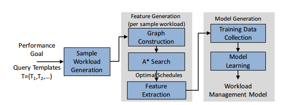
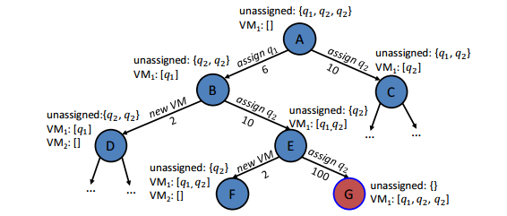
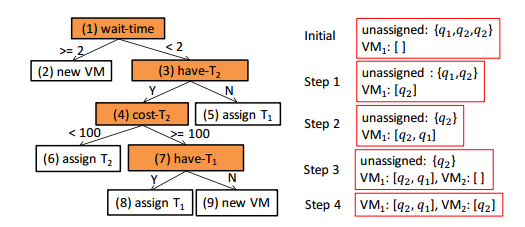
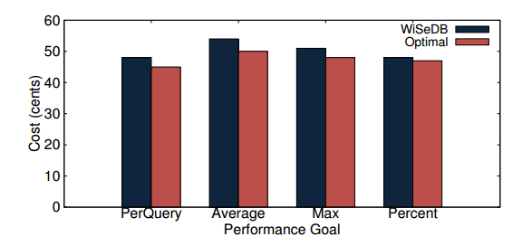
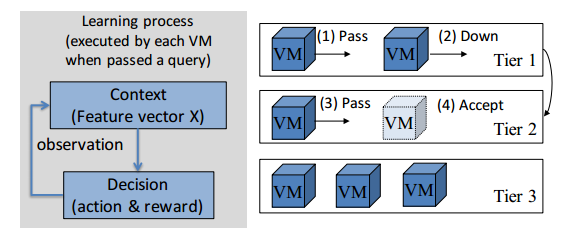

# 通过机器学习实现云数据库的工作负载管理

瑞恩马库斯，Olga Papaemmanouil

布兰迪斯大学

Email: ryan@cs.brandeis.edu，olga@cs.brandeis.edu

***摘要* - 随着弹性IaaS云持续变得比现场数据中心更具成本效益，各种数据管理应用程序正在迁移到按需付费的云计算资源。这些不同的应用程序具有同样多样化的性能目标，资源需求和预算约束。虽然现有的研究已经解决了诸如*查询放置*，调度和资源配置等个别任务以满足这些目标和约束，但这些技术无法提供端到端可定制的工作负载管理解决方案，导致应用程序开发人员手工制作适合他们的工作负载规格和性能目标的定制启发式方法。在本论文的愿景中，我们认为可以通过利用机器学习算法来解决工作负载管理挑战。可以针对特定于应用程序的属性和性能指标对这些算法进行训练，以自动学习如何配置资源以及分发和计划传入查询工作负载的执行。为实现这一目标，我们概述了WiSeDB的愿景，这是一种基于学习的服务，依赖于监督和强化学习，为静态和动态工作负载生成工作负载管理策略。**

## 一、介绍

　　云计算通过将数据处理服务变成按需付费的商品的方式，改变了以数据为中心的应用程序的部署方式。 随着基于云的数据库应用程序的多样性增加，需要服务的性能目标和工作负载特征的多样性同样增加。 同时，所有这些应用程序都需要在云基础架构上部署时解决常见的工作负载管理挑战。 这些包括以经济高效的方式处理诸如资源供应（租用/释放新VM），查询放置（将查询路由到VM）以及查询调度（VM内的处理顺序）等任务，同时满足应用程序的性能目标和约束。

　　目前的努力已经单独地并且基于每个应用来解决这些挑战（例如[1] - [4]）。但是，它们都受到两个主要限制。首先，虽然这些系统涵盖了广泛的性能标准（例如，响应时间[1]，[2]，平均工作负载延迟[3]），但每个系统都提供了针对特定性能指标进行调整的解决方案。使它们适应支持自定义性能目标并不是一项简单的任务，对具有不同性能属性的两个应用程序使用相同的查询调度或VM配置策略可能会导致重大的金钱损失或系统性能下降。其次，现有系统不提供端到端工作负载管理解决方案，而是关注问题的各个方面，例如查询放置[3]，调度[1]，[2]或资源配置[4]。由于这些解决方案是相互独立开发的，因此将它们集成到一个统一的框架中需要花费大量精力来为每个特定情况“正确”。因此，应用程序开发人员通常依靠特殊的自定义启发式方法来处理上述所有任务，旨在满足其性能目标和预算约束。

　　在本文中，我们分享了我们对基于学习的方法的愿景，以解决上述挑战。我们认为可以利用现有的机器学习技术来消除这种特殊的启发式方法，并将其替换为能够针对给定的应用程序和性能目标学习工作负载管理策略的系统。为实现这一目标，我们讨论了我们对WiSeDB的愿景，这是一种基于学习的工作负载顾问服务，旨在为基于云的数据管理应用程序生成工作负载管理策略。我们已经确定了这种服务的三个主要设计目标。首先，我们设想一种与度量无关的服务，允许应用程序定义自定义应用程序级性能目标，并在努力满足指定性能期望的同时，学习执行给定工作负载的“最佳”启发式算法。其次，考虑到传入的工作负载和性能目标，服务应提供端到端的解决方案，用于处理云基础架构上的工作负载，即指示：（a）要配置的云资源（例如，VM的数量/类型），（b）查询之间的资源分配（例如，哪个VM将执行给定查询）和（c）每个VM内的这些查询的执行顺序。最后，我们的服务应该具有成本意识，即提供针对货币成本优化的解决方案。

　　为了满足上述要求，WiSeDB将利用机器学习算法来识别用于执行传入工作负载的低成本启发式算法。 在这里，我们讨论了我们为实现WiSeDB愿景而研究的两种不同的学习方法。 具体来说，在第二部分中，我们演示了如何使用监督学习（特别是决策树分类器）来识别具有已知（或可预测）性能属性的工作负载的低成本解决方案。 在第三部分，我们讨论了一种强化学习方法，用于主动学习和动态更新不断变化的工作负载的工作负载管理策略。我们在第四部分总结了对我们计划进一步研究问题的讨论。

## 二、离线学习静态策略

　　在本节中，我们描述了我们为WiSeDB实现的”概念验证“监督学习框架SLEARN。 SLEARN利用决策树分类器自动“学习”执行传入工作负载的有效策略。 SLEARN的策略表示为针对应用程序定义的性能目标和工作负载规范进行调整的决策树模型。 决策模型是离线训练的，它们在运行时用于为与模型的工作负载规范匹配的任何查询集生成低成本执行策略。 具体而言，对于给定的传入查询集，WiSeDB解析模型以识别（a）要配置的VM的数量/类型，（b）将查询放置到这些VM以及（c）每个VM内的查询执行顺序。 每种模型都具有成本意识：它通过一系列绩效和成本相关的特征进行训练，这些特征可以解释供应成本以及因违反绩效目标而支付的任何罚金。

　　**工作负载和性能目标规范**　我们的学习框架允许用户指定一组代表性查询模板T1;T2; :::，每个对应于相同类型的查询组，因此当在相同的执行环境（例如，资源配置，并发查询等）上处理时，执行时间相似。 传入工作负载可以包括这些模板的任何查询组合。 每个模板的延迟估计也必须由应用程序本身提供（例如，通过在各种VM类型上先验地执行代表性查询），或者通过使用现有的预测模型[7]。

　　除了查询模板之外，应用程序还需要将性能目标指定为查询延迟的函数。我们当前对SLEARN的实现可以学习以下性能指标的有效策略：（1）*查询延迟*：用户指定每个查询模板的延迟的上限。 （2）*最大值*：用户表示其工作负载中最差查询响应时间的上限。 （3）*平均值*：工作负载的平均查询延迟的上限。 （4）*百分比*：指定必须在t秒内完成工作负载查询的至少x％。这些指标涵盖了通常用于云数据库的一系列性能目标（例如，[2] - [4]），但据我们所知，我们的框架是第一个支持所有这些目标的框架。性能目标表示为IaaS提供商与应用程序之间的服务级别协议（SLA）的一部分。协议规定了工作负载规范（即查询模板），预期性能目标和惩罚函数，该函数定义了如果不满足该目标则要支付给应用程序的惩罚。

　　**监督学习**　我们的监督学习框架通过图1所示的三步流程实现。首先，我们通过从指定的查询模板中随机绘制查询来创建少量的样本工作负载。 其次，对于每个随机工作负载，我们确定最佳工作负载执行策略，并从这些最佳解决方案中提取性能和成本相关特征。然后，我们在训练集上训练决策树分类器，其中包括我们为所有随机工作负载收集的所有特征和最优策略。 生成的决策模型代表了针对应用程序的查询模板和性能目标而定制的启发式工作负载管理。

　　　　　　　　　　　　　　　　　　　　　图１　SLEARN培训流程

　　　　　　　　　　　　　　　　　　　　　　图２　工作负载调度示例图

　　上述过程提出了两个主要挑战：（a）为给定的随机工作负载生成最佳执行策略;（b）识别可以有效表征这些最佳决策的特征集（例如，在现有VM上分配查询，提供新VM等）。为解决这些问题，SLEARN将给定工作负载调度的问题简化为导航图的问题。 它构造了一个有向加权图，其中顶点表示工作负载调度过程的步骤。 具体而言，每个顶点存储已调度查询的调度决策以及仍未分配的查询。 调度决策定义了为每个VM中的工作负载和查询队列供应的一组VM。

　　图2显示了查询集{q1;q2; q2}的一部分，其中qi表示模板Ti的查询。 对于给定的随机工作负载，图上的第一个顶点具有未分配的所有查询（即，节点A）。 箭头表示决定（a）将查询分配给所供应的VM之一（例如，从A到B的箭头）或（b）启动新VM（例如，从B到D）。 每个箭头的权重等于执行相应动作的成本。 该图允许我们为给定的工作负载生成并花费所有可能的决策。 找到最优策略（即，最低成本策略）简化为找到通过图的最短路径。 SLEARN使用A *算法[5]搜索图表，利用我们开发的一些搜索启发法来提高效率。

　　对于最优解决方案中的每个决策（即，对于最佳路径中的每个边缘），我们提取特征集以表征决策。 我们选择出现在人类衍生启发式[2]，[3]中的特征，希望机器学习算法能够为任意任务模板和性能目标构建自定义启发式算法。 提取的最重要的特征是：

　　1）等待时间：查询在执行之前必须等待的时间。 这有助于我们的模型根据截止日期决定应该放置哪些任务。

　　2）X成本：通过在最近创建的VM上放置模板X的查询而产生的成本（包括任何惩罚成本）。 这允许我们的模型检查放置某个查询的成本，并决定是分配它还是创建新VM。

　　3）have-X：模板X的查询是否仍未分配。 这有助于我们的模型了解未分配查询的模板如何影响最佳路径上的决策。

　　我们将所有收集的特征连接到一个集合中，并在其上训练决策树模型。 该模型将上述特征作为输入并预测边缘（即，决定提供新VM或将查询分配给VM）。 然后，可以使用此模型来调度给定查询模板的新工作负载。

　　　　　　　　　　　　　　　　　　　图３　SLEARN生成的示例决策树

　　图3显示了一个示例决策树。每个橙色节点表示一个特征的二进制拆分。决策节点（白色）表示建议的动作。图3的右侧显示了传入的工作负载fq1; Q2; q2g。为了安排此工作负载，我们按如下方式解析决策树。在第一个节点（1）中，我们检查等待时间，因为所有查询都是未分配的，所以我们继续执行（3）。工作负载具有模板T2的未分配查询，因此我们继续（4）。在这里，我们计算在VM上放置T2实例的成本（为简单起见，我们假设单个VM类型）。让我们假设成本小于100，这导致（6），其将T2的实例分配给初始VM（步骤1）。由于我们在工作负载中有更多查询，因此我们重新解析树。在（1）中，让我们假设最近VM上的等待时间是1分钟（这是T2中查询的运行时间），因此我们转到（3）。由于我们还有一个T2未分配的查询，我们转到（4）。让我们假设分配T2的查询的成本超过100（因为它需要等待q2才能完成）。我们转到（7）并检查是否有未分配的T1实例。由于存在，我们将q1分配给最后一个配置的VM（步骤2）。我们以相同的方式重新解析树，并遵循节点（1）！（2），然后再次作为（1）！（3）！（4）！（7）！（9），所以我们提供一个新的VM（步骤3）并将q2分配给它（步骤4）。

　　通常，决策模型将放置T2的实例，然后是T1的实例，然后创建新的VM。 这种情况一直持续到T1或T2的任务耗尽为止。 然后，将剩余模板的单个实例放置在新VM上，直到没有剩余模板。 对于这两个查询模板的情况，SLEARN学习的启发式等同于按递增的延迟顺序对查询进行排序，并将每个查询放在查询“适合”的第一个VM上（即，不会产生任何惩罚）。

　　**结果。**图4显示了针对四个性能指标在10个查询模板中统一分布的30个查询的工作负载调度成本。 Max要求最大查询延迟小于10分钟，是我们工作负载中最长查询的延迟的2.5倍。 PerQuery要求每个查询的最终延迟不超过其单个延迟的2.5倍。平均值要求平均查询延迟小于4分钟，而Percent要求90％的查询以10分钟结束。该实验使用TPC-H基准测试在Amazon EC2实例上进行，其中查询模板1-10用作查询模板。在这里，我们将WiSeDB生成的计划与此特定设置的最佳强制计划进行比较。 WiSeDB的时间表在所有性能指标的最低成本计划的8％之内。这些结果与运行时工作负载的大小和性能指标的严格性无关。 SLEARN还可以非常快速地学习模型，最多需要一分钟来训练15个查询模板的工作量。

　　　　　　　　　　　　　　图４　与最佳时间表相比，SLEARN模型的性能

## 三、自适应学习动态战略

　　我们的监督学习技术依赖于两个假设。 首先，传入的工作负载将包含已知的查询模板，其次，可以预测这些查询模板的执行时间。 但是，过多的以数据为中心的应用程序需要支持涉及以前没有见过的查询的动态工作负载，这些动态工作负载涉及用户探索数据，搜索不规则等以及性能预测是主要挑战。 在动态设置中，SLEARN生成的固定策略的性能可能会非常快速地衰减。 为了解决这一局限，我们为RLEARN绘制了基础，RLEARN是一种强化学习方法，可用于自适应地学习动态变化工作负载的工作负载管理策略。

　　**强化学习。**强化学习与标准监督学习的不同之处在于，不需要先验地做出最佳/正确的决策。 系统决定一个动作以最大化累积奖励。 它从过去（可能是次优的）决策中学习，并且其决策随着时间的推移而改善。 在这里，重点是在线学习，其中包括在探索（基于已获得的知识的奖励最大化）和利用（尝试新的行动以进一步增加知识）之间找到平衡。 在机器学习中，已经在上下文多臂强盗（CMAB）问题中研究了这种权衡[6]。

　　CMAB是这样一个问题，赌徒在一排老虎机（单臂匪徒）上玩，并需要决定玩哪些机器（即，拉动哪些臂），以便最大化所获得的奖励总和。 在每一轮中，玩家决定玩哪台机器（动作a）并获得奖励r。 通过观察特征向量X（也称为上下文）来做出决定，该特征向量X在该迭代中总结了关于机器状态的信息。 赌徒然后通过新的观察改进他们的战略｛a;X;r｝。 赌徒的目标是获得最高的累积奖励。 因此，赌徒的目的是收集关于特征向量和奖励相关的信息，以便他们可以通过查看特征向量来预测下一个最佳去玩的机器。

　　我们的工作负载管理问题可以建模为CMAB的分层网络，如图5所示。每个VM对应于多个层之一的老虎机，其中每个层代表不同类型的VM。可以根据价格或性能/资源标准订购等级。每台机器都有三个臂/动作：接受，通过和向下。当查询进入系统时，它首先被提供给根机器（左上角）。该算法基于一组特征来做出决定，这些特征捕获关于新查询的信息和底层VM的当前状态。如果选择“接受”操作，则会将查询添加到VM的执行队列中。如果选择“通过”操作，则查询将传递到同一层中的另一个VM。如果没有其他VM，则配置该层的新VM。如果选择“向下”操作，则查询将向下传递到下一层中的第一个VM。最后一层不包含向下的臂。网络不包含循环，因此某些VM最终会接受查询。

　　　　　　　　　　　　　　　图５　RLEARN学习过程和示例决策过程

　　在执行查询后就确定了每个决策的奖励。假设一个查询获得服务提供者x美元并且处理查询需要y美元，则累积奖励是利润x-y。由于每个CMAB都力求最大化自己的奖励，因此没有必要“分割”CMAB之间的利润 - 每个CMAB都可以假设它独立地实现了整个利润。可以将此技术视为反向传播从接受VM到将查询传递到该VM所涉及的CMAB的奖励。每个CMAB都为其奖励观察添加了一个新条目，随着越来越多的查询在系统中移动，每个CMAB的观察结果变得越来越大，整个系统将学习工作负载管理策略。最后，上下文信息X在应用程序之间会有很大差异。对于数据库应用程序，特征向量可以包含性能指示符（例如，查询[7]所需的逻辑I / O的数量），VM队列中的查询，它们访问的表等。

　　为了说明这个过程，让我们假设一个CMAB网络支付4美元来处理查询。 由于网络没有先前的经验，它错误地提供了10个新VM（每个新的CMAB选择Pass操作）并将查询分配给最后一个VM（第10个CMAB选择Accept arm）。 假设虚拟机的成本为1美元，处理查询的成本为1美元，当机器的上下文指示它为空时，决定通过查询将奖励4美元 - 11美元= - 7美元。 现在，当他们还没有接受任何查询时，网络中的每个CMAB都会偏向于拉动右臂。 当新查询到达时，第一个CMAB可能会接受它（赚取3美元的利润），或者向下传递。 在第一种情况下，CMAB会将积极奖励与空白时选择“接受”操作相关联。 随着越来越多的查询流经网络，每个CMAB将获得更多经验，从而做出更明智的决策。

　　一种有效解决CMAB问题的算法是Thompson抽样[6]，它选择最大化预期奖励的行为与随机抽取的信念相关。采样可以通过贝叶斯方法实现如下。该组过去观察D由三元组（ai; Xi; ri）构成，并且根据一些参数θ使用参数似然函数P（rja; x;θ）来建模。对于通用应用，θ可以是用于将Xi中的每个特征与奖励相关联的每个臂的线性模型的一组系数。给定这些参数的一些先验分布P（θ），这些参数的后验分布由贝叶斯规则给出，P（θjD）= P（Djθ）P（θ）。在实践中，该方法通过在每一轮中从后P（θjD）采样参数θ并且在给定参数θ，动作和当前上下文的情况下选择使期望奖励最大化的动作a来实现。从概念上讲，这意味着玩家在每一轮中随机地实例化他们的信念，然后根据他们最佳地行动。

## 四、开放的挑战和正在进行的工作

　　我们的两种基于学习的方法表明，在将机器学习算法应用于云数据库的工作负载管理问题方面存在进步的空间。 总的来说，我们相信WiSeDB开辟了令人兴奋的研究路径，其中一些我们接下来将重点介绍。

　　**自适应建模**。通常希望允许应用程序探索其工作负载的潜在性能和成本权衡。 这意味着为相同的工作负载生成不同的模型，具有更严格/更宽松的性能约束，从而更高/更低的成本。 但是，SLEARN会针对特定的性能目标调整其决策模型，并且此目标的更改将触发WiSeDB重新训练决策模型。 我们正在研究一种技术，该技术可以针对给定工作负载和性能目标调整现有模型，以最少的训练生成针对相同工作负载但更严格目标的新模型。 主要思想是，如果针对相同的查询模板和类似的性能目标训练两个决策模型，则他们的训练集将共享重要信息。 我们的技术旨在识别和重用这些共性。

　　**在线调度**。 每次任务进入系统时，都会支付RLEARN的训练费用。 此外，使用RLEARN，在我们的示例中使用基本FIFO队列来处理VM内的调度。 为了让RLEARN能够学习更高级的查询调度策略，可以用连续武装强盗[8]替换Accept的单一选择，它选择一个介于0和1之间的数字作为优先级，而不是简单地拉动一个臂（布尔值））。

## 致谢

　　该研究由NSF IIS 1253196资助。

## 参考文献

[1] Chi et al. SLA-tree: a framework for efficiently supporting SLA-based decisions in cloud computing. EDBT ’11.

[2] Chi et al. iCBS: incremental cost-based scheduling under piecewise linear SLAs. VLDB ’11.

[3] Liu et al. PMAX: tenant placement in multitenant databases for profit maximization. EDBT ’13.

[4] Jalaparti et al. Bridging the Tenant-Provider Gap in Cloud Services. SOCC ’12.

[5] Hart et al. A Formal Basis for the Heuristic Determination of Minimum Cost Paths. IEEE SSC ’68.

[6] Chapelle et al. An empr. evaluation of Thompson sampling. NIPS ’11.

[7] Duggan et al. Performance Prediction for Concurrent Database Workloads. SIGMOD 2011.

[8] Auer et al. Improved rates for the stochastic continuum-armed bandit problem. Learning Theory ’07.

