# 通过大规模机器学习来自动进行数据管理系统的调节

- Dana Van Aken   Carnegie Mellon University  dvanaken@cs.cmu.edu 

- Andrew Pavlo   Carnegie Mellon University  pavlo@cs.cmu.edu  

- Geoffrey J. Gordon   Carnegie Mellon University  ggordon@cs.cmu.edu 
- Bohan Zhang  Peking University   bohan@pku.edu.cn 

##  摘要

​	数据库管理系统（DBMS）配置调优是任何数据密集型应用程序工作的一个重要方面。 但是这个是一个历史性难题，因为数据库管理系统有数百个配置“旋钮”来控制系统中的所有内容，例如用于缓存的内存量和数据写入存储的频率。 这些旋钮的问题在于它们没有标准化（例如两个DBMS中相同的旋钮使用不同的名称），不独立（即改变一个旋钮会影响其他的按钮），不通用（即对于一个应用程序可能有效但对另一个来说却是次优的）。 更糟的是，这些旋钮的效果信息通常只来自于（昂贵的）经验。

​	为了克服这些挑战，我们提出了一种自动化方法，利用过去的经验并收集新的信息进行调整DBMS配置，我们使用有监督和无监督机器学习方法的组合来进行：（1）选择最具影响力的旋钮，（2）将没见过的数据库工作负载映射到以前的工作负载，以便我们可以传输经验，和（3）推荐旋钮设置。 我们用一种新的工具OtterTune实现了我们的技术，并在三个DBMS上进行测试。 我们的评估显示OtterTune推荐的配置跟现有工具或人类专家产生的结果一样或更好。

## 1、介绍

​	收集、处理和分析大量数据的能力对于推断商业和科学领域的新知识至关重要[35,25]。 DBMS是数据密集型（大数据）应用程序的关键组件[46]。 这些系统的性能通常用如下指标进行衡量，吞吐量（例如，它可以多快地收集新数据）和延迟（例如，它可以以多快的速度回应请求）。

​	在数据库管理系统中实现良好的性能是不简单的，因为它们是很复杂的系统，具有许多可调节选项，可控制他们运行时操作的几乎所有方面[24]。 这种配置旋钮允许数据库管理员（DBA）控制DBMS运行时行为的各个方面。 例如，他们可以设置系统为数据缓存分配多少内存，或者为事务日志缓冲区分配多少内存。现代DBMS因拥有许多配置旋钮而臭名昭著[22,47,36]。 使得DBMS高深莫测的一部分原因是，它们的性能和可扩展性高度依赖于它们的配置。 进一步加剧了这个问题的是，这些旋钮的默认配置是非常糟糕的。例如，2016年MySQL的默认配置是，假定它被部署在一个只有160 MB RAM的机器上[1]。

​	由于这些原因，许多组织聘用昂贵的专家为预期的工作负载配置系统的旋钮。 但是随着数据库和应用程序的规模和复杂性都在不断增长，优化数据库管理系统以满足应用程序的需求已经超越人类的能力[11]。 这是因为DBMS的正确配置高度依赖于许多因素，超出了人类可以推论的范围。

​	之前尝试使用自动DBMS配置工具，某些缺陷使其不适合一般用途的数据库应用。 这些调整工具许多都是由供应商开发的，因此它们只支持这个特定公司的DBMS [22,33,37]。 少数支持多个DBMS的调优工具仍需要手动步骤，例如需要DBA来做：（1）部署数据库的第二个副本[24]，（2）匹配旋钮之间的依赖关系[49]，或（3）指导培训过程[58]。所有这些工具都会独立检查每个DBMS部署，因此无法应用以前调整工作所获得的知识。 这样效率是非常低的，因为每个调整工作都可能需要很长时间并使用大量资源。

​	在本文中，我们提出了一种技术来重用从以前会话中收集的训练数据以调整新的DBMS部署。我们方法的关键是从之前的调节中收集测量数据，训练机器学习（ML）模型，和使用模型来：（1）选择最重要的旋钮，（2）将之前未见过的数据库工作负载映射到已知工作负载，以便我们可以传递以前的经验，和（3）推荐旋钮设置，这样做来改进目标（例如延迟、吞吐量）。重用过去的经验减少了为新应用程序调优DBMS所花费的时间和资源。为了评估我们的工作，我们使用谷歌TensorFlow [50]和Python的scikit-learn [39]在一个名为OtterTune的调优工具中，并为两个OLTP DBMS（MySQL，Postgres）和一个OLAP DBMS（Vector）进行了实验。我们的结果表明，OtterTune为这些工作负载生成一个DBMS配置与其默认设置或由其他调整顾问生成的配置相比，延迟时间缩短了58-94％。我们也展示OtterTune会在60分钟内生成配置，是专家DBA创建配置时间的94%。

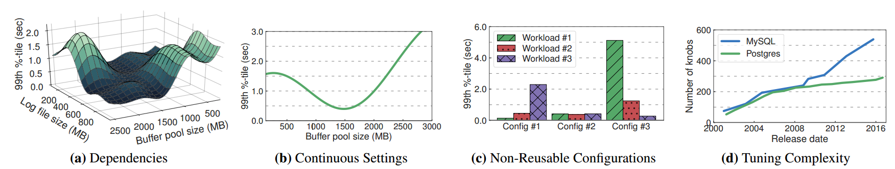

**图1：激励示例图** -图1a至1c显示了使用不同配置设置在MySQL（v5.6）上运行的YCSB工作负载的性能测量。 图1d显示了随着时间推移MySQL和Postgres版本中提供的可调旋钮的数量。

​	本文的其余部分安排如下。 第二章首先讨论数据库调优中的挑战，然后我们在第三章中概述我们的方法。 然后在第四章中描述我们收集DBMS指标的技术。在第五章识别影响最大的旋钮，并在第六章中推荐设置。 第七章，我们展示我们的实验评测。 最后，第八章我们总结了相关的工作。

## 2、动机

​	调整DBMS有一些规则或“最佳实践”准则，但对于各种各样的应用程序和硬件配置来说，这些准则并不总是能够提供良好的结果。 虽然人们可以依靠某些规则，在一个特定的DBMS上取得好的表现，但它们并不能适用于所有的应用程序。 因此，许多组织聘用昂贵的专家来调整他们的系统。 例如，2013年的一项调查发现，40％对大型Postgres服务公司的请求是针对DBMS调优和旋钮配置问题的[36]。

​	调整DBMS的一种常见方法是DBA将数据库的拷贝发送到另一台计算机，并手动测量实际应用程序的示例工作负载的性能。 基于这个测试的结果，他们会根据过去的经验，利用调整指导方针和直觉的一些组合调整DBMS的配置。 然后DBA重复实验以查看性能是否提高[47]。 这种对数据库管理系统进行调整的“试错法”是单调乏味的、代价昂贵且效率低下，因为（1）许多旋钮不是独立的[24]，（2）一些旋钮的值是连续的，（3）通常不能重用从一个应用程序到下一个应用程序的相同配置（4）DBMS总是添加新的旋钮。

​	我们现在进一步详细讨论这些问题。 为了突出它们的影响，我们使用MySQL（v5.6）进行了一系列实验，用不同的旋钮执行YCSB工作负载的不同设置。 我们在第7章详细介绍了我们这些实验的运营环境。

​        **依赖关系：**DBMS调优指南强烈建议DBA一次只更换一个旋钮。这是明智的，但是大量的旋钮会导致出奇的慢。这也不完全有帮助，因为改变一个旋钮可能会影响另一个旋钮的好处。但人们很难理解一个旋钮的影响，更不用说多个之间的相互作用。旋钮设置的不同组合意味着找到最佳配置是NP-hard [49]。为了说明这一点，我们测量了MySQL针对不同配置的性能改变其缓冲池1的大小和其日志文件的大小，结果如图1a所示，当缓冲池和日志文件大小都很大时，DBMS实现了更好的性能。但是一般来说，当缓冲池大小和日志文件大小是“平衡的”时，延迟会很低。如果缓冲池很大并且日志文件很小，那么DBMS为了保持较少数量的脏页面，必须执行更多的冲洗磁盘。

​        **连续设置：** DBMS调整的另一个困难方面是有许多可能的旋钮设置，并且从一个设置到下一个设置的性能差异可能是不规则的。 例如，DBMS的缓冲池的大小可以是一个从零到系统上DRAM的数量的任意值。在某些范围内，此旋钮增加0.1 GB可能无关紧要，而在其他范围内，增加0.1 GB可能会导致随着DBMS耗尽物理内存，性能会急剧下降。 为了说明这一点，我们进行了另一个实验，我们将MySQL的缓冲池大小从10 MB增加到3 GB。图1b中的结果显示延迟持续改善直到1.5 GB，之后性能下降，因为DBMS耗尽物理内存。

​        **不可重用的配置：** DBA在调整一个DBMS时所花费的努力不会使调整下一个更容易。 这是因为一个应用程序的最佳配置可能对另一个不是最好的。 在这个实验中，我们使用三个MySQL旋钮配置执行三个YCSB工作负载。 每个配置旨在为其中一个提供最佳延迟工作负载（即配置＃1对于工作负载＃1是最好的，对于＃2也是一样和＃3）。 图1c显示了每个工作负载的最佳配置对另一个来说是最糟糕的。 例如，从配置＃1切换到config＃3将MySQL的工作负载＃3的延迟提高了90％，但是工作负载＃1的延迟降低了3500％。 配置＃2提供整体表现最好。 但是，工作负载＃1和＃3使用其优化配置可以提高2倍以上。

​        **调整复杂性：** 最后，随着新版本和功能的发布，DBMS旋钮的数量一直在增加。 数据库管理员难以跟上这些变化并理解这将如何影响他们的系统。 图1d中的图表显示不同版本的MySQL和Postgres的旋钮数量可以追溯到2001年。这表明，15年以来Postgres旋钮的数量增加了3倍，MySQL增加了将近6倍。

​	以上示例显示了配置DBMS的难度。这种复杂性是导致数据库系统高总成本的主要原因。 人员估计是大规模数据库管理系统总拥有成本的50％[43]，许多DBA花费近25％的时间在调整上[21]。

​	比单独检查每个数据库应用程序更好的方法是，使用一个自动化工具，利用从一个应用程序获得的知识帮助调整其他的应用程序。

## 3、系统总览

​	我们现在介绍我们的数据库自动调整工具，它可以克服上述问题。 OtterTune是一个与任何DBMS一起工作的调优服务。 它从以前的调整会话收集的数据来维护一个数据库，并使用此数据建立DBMS对不同旋钮配置如何响应的模型。 对于新的应用程序，它使用这些模型来指导实验并推荐最佳设置。 每个建议为OtterTune提供更多信息的反馈，允许它改进模型并提高其准确性。

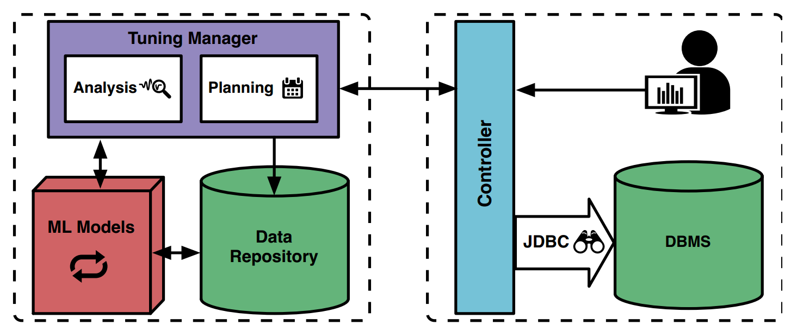

**图2：OtterTune架构** - OtterTune系统中组件的概述。 控制器连接到DBMS并收集有关系统性能的信息。 然后将此信息发送到调优管理器，并将其存储在其存储库中。 然后，它构建用于为DBMS选择最佳配置的模型。

​	图2显示了OtterTune架构的概述。 该系统由两部分组成。 第一个是客户端控制器，与要调整的目标DBMS进行交互。 它使用标准API（例如JDBC）从DBMS收集运行时信息，安装新配置并收集性能测量结果。

​	第二部分是OtterTune的调整管理器。 它收到了从控制器收集的信息，并将其与以前调整会话中的数据一起存储在其存储库中。 这个存储库不包含任何关于DBMS或其数据库的机密信息; 它只包含旋钮配置和性能数据。 OtterTune根据主要DBMS版本来组织这些数据（例如，Postgres v9.3的数据与Postgres v9.4是分开的）。 这可以防止OtterTune从DBMS旧版本中调整旋钮，这些旋钮在新版本中可能会被弃用，或者只存在于较新的版本中。 调整管理器也支持在后台流程的中不断分析新数据并改进OtterTune的内部ML模型。 这些模型允许它在没有人工输入的情况下识别相关的旋钮和指标，并且在存储库中查找与目标类似的工作负载。

### 3.1例子

​	在新的调优会话开始时，DBA告诉OtterTune在选择配置时要优化什么度量指标（例如延迟，吞吐量）。 然后OtterTune控制器连接到目标DBMS并收集其硬件配置文件和当前旋钮的配置。 我们假设这个硬件配置文件是单一的来自预定义类型列表的标识符（例如，一个Amazon EC2的实例类型）。 我们将自动确定DBMS部署的硬件功能推迟到未来的工作。

​	控制器然后开始第一个观察期。 这时控制器将观察DBMS一段时间并衡量由DBA选择的独立于DBMS的外部度量标准（例如，延迟）。 DBA可以选择执行一组针对固定时间段或特定工作量跟踪的查询。如果DBA选择第一个选项，那么观察期的长度等于固定时间段。 否则，持续时间取决于DBMS重放工作负载跟踪需要多长时间。 固定观察周期非常适合OLTP工作负载所特有的快速简单查询，而对于执行OLAP工作负载中存在的长时间复杂查询，通常需要可变长度周期。

​	在观察期结束时，控制器会收集其他DBMS特定的内部度量标准。 例如包括MySQL读取或写入磁盘页面的计数器。 其他DBMS提供了类似的指标，但OtterTune不需要DBA提供任何关于它们含义的信息，无论它们是表现出好的还是差的表现，或者具有不同名称的指标在不同的DBMS中意味着相同的事情。 我们将在第四章中进一步详细讨论这个度量集合，以及在第五章中我们按照DBMS的旋钮的重要性进行排序的方法。

​	当OtterTune的调谐管理器从控制器收到新观测期的结果时，它首先将该信息存储在其存储库中。然后OtterTune由此计算控制器应该在目标DBMS上安装的下一个配置。正如我们在第六章中讨论的那样，选择下一个配置是OtterTune的关键任务。每个观察周期后都会有两个不同的步骤来确定系统将推荐的配置。在第一步中，OtterTune会尝试“理解”目标工作负载，并将其跟过去所看到（和调优过）的相同DBMS和硬件配置文件的工作负载进行匹配。一旦调优管理器使用迄今为止收集的数据找到了最佳匹配，就开始第二步，推荐一个专门设计用于改进当前工作负载、DBMS和硬件的旋钮配置。为了帮助DBA决定是否终止优化会话，OtterTune控制器提供推荐的配置与目前为止所见的最佳配置相比有多好的估计，此过程一直持续到DBA对初始配置的改进满意为止。

### 3.2假设和限制

​	关于OtterTune功能的几个方面我们必须指出。 其中最重要的是，我们假设控制器具有管理权限来修改DBMS的配置（包括必要时重新启动DBMS）。 如果这不可行，那么DBA可以在单独的硬件上部署数据库的第二个副本，以进行OtterTune的调试试用。 这要求DBA重放工作负载跟踪或转发来自生产库DBMS的查询。 这与之前的工具[24]中使用方法相同。

​	重新启动数据库管理系统通常是必要的，因为一些旋钮只有在系统停止并启动后才会生效。 某些旋钮还会使DBMS在重新联机时执行额外的处理（例如调整日志文件大小），根据数据库和硬件的不同，这可能需要几分钟的时间。 目前OtterTune在其建议中忽略了重新启动DBMS的成本。我们将自动识别这些旋钮，并在选择配置时考虑重新启动的代价推迟为未来的工作。

​	由于重新启动DBMS是不可取的，许多DBMS支持动态更改某些旋钮，而无需重新启动系统。 OtterTune存储了它支持的每个DBMS版本上可用的动态旋钮列表，以及如何更新它们的说明。只有当正在调谐的一组旋钮需要时，才会重新启动DBMS。 DBA也可以在调谐会话开始时选择仅调整动态旋钮。这是DBA禁用重新启动DBMS时可用的另一种选择。我们为OtterTune支持的每个DBMS版本维护一个策划黑名单。在每次调谐会话开始时，这个黑名单都会提供给DBA。 DBA可以添加他们希望OtterTune避免调优的其他任何旋钮。这样的旋钮可能是对调整没有意义的旋钮（例如，DBMS存储文件的路径名称），或者可能具有隐藏或严重后果（例如，可能导致DBMS丢失数据）的旋钮。同样，自动确定更改旋钮是否会导致应用程序潜在丢失数据超出了我们在此工作的范围。

​	最后，我们还假定数据库的物理设计是合理的。 这意味着DBA已经安装了适当的索引，具体的视图和其他数据库元素。已经有相当数量的自动化数据库设计的研究，DBA可以为此使用这些设计。正如附录C所讨论的，我们计划研究如何应用这些相同的技术来调整数据库的物理设计。

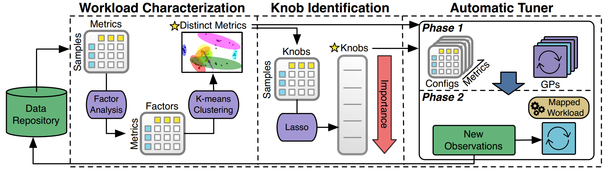

**图3：OtterTune机器学习管道** - 此图显示了OtterTune中数据的处理路径。 以前的所有观察都存在于其存储库中 首先将此数据传递到Workload Characterization（Sect.4）组件，该组件标识最有区别的DBMS度量标准。 接下来，旋钮识别（Sect.5）组件生成最重要的旋钮的排序列表。 然后将所有这些信息输入自动调谐器（Sect.6）组件，在此组件中，它将目标DBMS的工作负载映射到先前看到的工作负载，并生成更好的配置。

​	在接下来的部分中，我们描述了OtterTune在调优会话期间如何从DBMS收集运行时指标。 然后，根据这些数据创建模型，以便（1）选择最具影响力的旋钮，（2）将之前未见过的数据库工作负载匹配到已知工作负载，以及（3）建议旋钮设置。 我们首先讨论如何识别调优工具收集的哪些指标最能表征应用程序的工作负载。 整个过程的概览如图3所示。

## 4、工作负载表征

​	调优系统的第一步是发现一个最能代表目标工作负载的显著特点的模型，以便它可以识别存储库中以前看到与之类似的的工作负载。 这使得OtterTune能够利用从以前的调谐会话中收集的信息来帮助指导搜索新应用的良好旋钮配置。

​	我们可能会考虑两种方法来做到这一点。 首先是在逻辑层面分析目标工作负载。 这意味着检查查询和数据库模式以计算度量标准，例如每个查询访问的表/列的数量以及事务的读/写比率。 这些度量可以使用DBMS的“假设”优化器API进一步细化，可以更精确地评估这些度量[15]，比如最常访问的索引。 然而，这种方法的问题在于，不可能确定更改特定旋钮的影响，因为所有这些估计都基于逻辑数据库而不是查询的实际运行时行为。 此外，DBMS如何执行查询以及查询如何与受调谐旋钮影响的内部组件相关取决于数据库的许多因素（例如，大小，基数，工作集大小）。 因此，只通过检查工作负载无法获得这些信息。

​	更好的方法是使用DBMS的内部运行时度量标准来表征工作负载的行为。所有现代DBMS都公开了大量关于系统的信息。例如，MySQL的InnoDB引擎提供了读/写页数，查询缓存利用率和锁定开销的统计信息。 OtterTune使用执行时记录的运行时统计信息来表征工作负载。这些度量标准可以更准确地表征工作负载，因为它们捕获了其运行时行为的更多方面。它们的另一个优点是它们直接受到旋钮设置的影响。例如，如果旋钮控制DBMS分配给其缓冲池的内存量太低，则这些度量标准将指示缓冲池高速缓存数据丢失的数量增加。所有的DBMS都提供类似的信息，只是名称和粒度不同。但正如我们将要展示的那样，OtterTune的模型构建算法不需要对指标进行标记。

### 4.1统计收集

​	OtterTune的控制器支持模块化体系结构，使其能够为不同的DBMS执行适当的操作来收集其运行时统计信息。 在每个观察期开始时，控制器首先重置目标DBMS的所有统计数据。 然后，在该周期结束时检索新的统计数据。由于此时OtterTune不知道哪些度量标准实际上是有用的，因此它会收集DBMS提供的每个数字度量标准，并将其作为键/值对存储在其存储库中。

​	此收集过程中的主要挑战是如何表示DBMS和数据库的子元素的度量标准。 有些系统，如MySQL，只报告整个DBMS的统计数据。 但是其他系统为表或数据库提供单独的统计信息。 商业DBMS甚至为各个组件维护单独的统计信息（例如，IBM DB2跟踪每个缓冲池实例的统计信息）。 这个细粒度数据的问题在于DBMS提供了多个具有相同名称的度量。

​	一种可能的解决方案是将子元素的名称作为度量标准的名称。 例如，对于表“foo”读取的块数，Postgres的度量值将作为foo.heap_blks_read存储在存储库中。 但是这种方法意味着它不能将这个度量映射到其他数据库，因为它们的表名称不同。 OtterTune改为存储与单个总和标量值同名的指标。 这是有效的，因为OtterTune目前只考虑全局旋钮。 我们将调整表格或组件专用旋钮的问题推迟为未来的工作。

### 4.2修剪冗余指标

​	下一步是自动删除多余的指标。 删除这些元素非常重要，以便OtterTune只需考虑捕获性能变化和区分不同工作负载特征的最小指标集。 减小这个集合的大小减少了ML算法的搜索空间，这反过来又加速了整个过程，并使模型在OtterTune的调谐管理器中的内存占用更合适。 我们将在随后的章节中展示OtterTune可用的指标足以区分部署在同一硬件上的DBMS的工作负载。

​	冗余DBMS指标的出现有两个原因。第一种是系统中完全相同的指标，只是粒度不同。例如，MySQL中以字节和页面的形式报告读取的数据量。这两个指标是相同的，只是单位不同，因此没有必要同时考虑它们。另一种类型的冗余指标是代表DBMS的独立组件，但是它们的值高度相关的指标。 例如，我们从实验中发现，Postgres指标中更新的元组数量几乎与测量从缓冲区读取的块数量的指标一致。

​	我们使用两种经过充分研究的技术进行修剪。 第一种是维数降低技术，称为因子分析（FA）[5]，它将（可能的）高维DBMS指标数据转换为低维数据。 然后我们使用第二种技术，称为k-means [6]，将这种低维数据聚类成有意义的组。 使用降维技术是许多聚类算法的预处理步骤，因为它们减少了数据中“噪声”的数量[31,30]。 这提高了聚类分析的稳健性和质量。

​	给定一组包含任意相关性的实值变量，FA将这些变量减少到一组较小的因子，这些因子捕获原始变量的相关模式。 每个因子都是原始变量的线性组合; 因子系数类似于并且可以以与线性回归中的系数相同的方式解释。 此外，每个因子都有单位方差，与所有其他因子不相关。 这意味着可以根据他们解释的原始数据的多少变化来排序因子。 我们发现只有初始因子对我们的DBMS度量数据有意义，这意味着大多数可变性都是由前几个因子捕获的。

​	FA算法将矩阵X作为输入，矩阵X的行对应于指标，其列对应于我们尝试过的旋钮配置。 条目Xij是配置j上的指标i的值。 FA给出了较小的矩阵U：U的行对应于指标，而列对应于因子，条目Uij是因子j中的指标i的系数。 我们可以使用U的第i行的元素作为指标i的坐标来分散绘制度量。 如果在U中具有相似的系数，则指标i和j将靠近在一起 。 也就是说，如果它们倾向于在X中强烈关联。现在删除冗余度量意味着在散点图中删除彼此过于接近的度量。

​	然后，我们使用每个指标的U行作为其坐标，通过k-means聚集指标。 我们为每个群集保留一个度量标准，即最接近群集中心的度量标准。 使用k均值的一个缺点是它需要最佳数量的簇（K）作为其输入。 我们使用一个简单的启发式[40]来完全自动化这个选择过程并近似K。虽然这种方法不能保证找到最优解，但它不需要人类手动解释问题的图形表示来确定最佳数量群集。 我们将这种启发式算法与其他技术[55,48]进行了比较，以便选择K，并发现它们选择的值最多只能与我们的近似值相差一到两个簇。 这些变化对OtterTune在我们第七章的实验评估中产生的配置质量几乎没有影响。

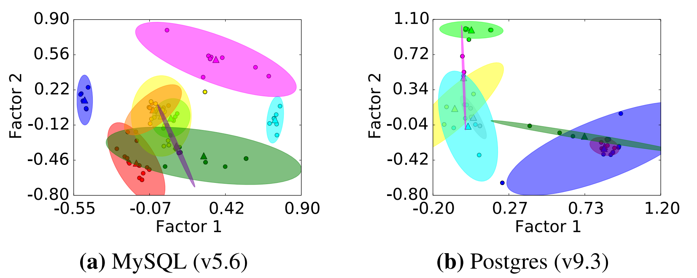

**图4：度量标准聚类** - 使用k-means对DBMS度量进行分组，这些度量基于因子分析所确定的彼此之间的相似程度，并通过其（f1，f2）坐标绘制。 每个指标的颜色显示其集群成员资格。 三角形代表聚类中心。

​	图4中的可视化显示了MySQL和Postgres中散点图和度量集群的二维投影。 在图4a中的MySQL集群中，OtterTune总共识别出九个集群。 这些集群对应于DBMS性能的不同方面。 例如，在MySQL的情况下，衡量写入的数据量，读取的数据量以及等待资源所花费的时间的度量标准都被分组到同一个集群中。 在图4b中，我们看到OtterTune为Postgres的指标选择了八个集群。 与MySQL一样，每个集群中的指标对应于类似地度量。 但在Postgres中，度量标准聚集在系统中的特定组件上，如后台编写器和索引。

​	这种聚类的一个有趣发现是OtterTune倾向于将无用的度量（例如，SSL连接数据）组合在一起。 但是，它没有一种程序化的方式来确定它们是真正无用的，因此它必须将它们包括在进一步的计算中。 我们可以为系统提供一个或多个这些指标的提示，然后丢弃它映射的集群。

​	从最初的131个MySQL指标和57个Postgres指标中，我们可以将指标数量分别减少93％和82％。请注意，即使将其标记为冗余，OtterTune仍会在其存储库中收集和存储所有DBMS指标的数据。 修剪FA减少后保留的度量集仅考虑我们在下一节中讨论的其他ML组件。

## 5、识别重要的KNOBS

​	修剪冗余指标后，OtterTune接下来会确定哪些旋钮对DBA的目标函数影响最大。 DBMS可以有数百个旋钮，但只有一个子集实际上会影响DBMS的性能。 因此，必须考虑到减少旋钮数限制了可能DBMS的配置总数。 我们想要发现消极和积极的相关性。 例如，减少为DBMS缓冲池分配的内存量可能会降低系统的总体延迟，我们希望发现这种对DBMS性能的强烈影响（虽然是负面影响）。

​	OtterTune使用流行的特征选择技术进行线性回归，称为Lasso [54]，以揭示与系统整体性能最强相关的旋钮。 为了检测旋钮之间的非线性相关性和依赖性，我们还在回归中包括多项式特征。

​	当新数据从不同的调整会话到达时，OtterTune的调优管理器会在后台连续执行这些计算。 在我们的实验中，Lasso的每次调用都需要大约20分钟，并且需要大约10 GB的内存用于由100k个试验以及数百万个数据点组成的存储库。 然后，我们发现的依赖关系和相关性将用于OtterTune的推荐算法，在第六章中介绍。

​	我们现在描述如何使用Lasso来识别重要的旋钮以及它们之间可能存在的依赖关系。 然后我们讨论OtterTune在调优过程中如何使用它。

### 5.1使用Lasso进行特征选择

​	线性回归是一种统计方法，用于确定一个或多个因变量（y）与每个自变量（X）之间关系的强度。 使用线性预测器函数对这些关系建模，该线性预测器函数的权重（即，系数）是从数据估计的。

​	拟合线性回归模型的最常用方法是普通最小二乘法（OLS），其通过最小化残差平方误差来估计回归权重。 这样的模型允许人们对权重进行统计检验，以评估每个自变量的影响的显着性[14]。 虽然OtterTune可以使用这些测量来确定旋钮顺序，但OLS有两个缺点，它在高（更高）维度环境中是一个不能令人满意的解决方案。 起初，估计具有低偏差但高方差，并且随着模型中包括更多特征，方差继续增加。 高方差降低了模型的预测和变量选择精度。 其次，随着特征数量的增加，估计变得难以解释，因为永远不会移除无关特征（即，OLS不执行特征选择）。

​	为了避免这些问题，OtterTune采用了一种称为Lasso的最小二乘法的正则化版本，它通过惩罚具有大权重的模型来减少线性回归模型中无关变量的影响。 与其他正则化和特征选择方法相比，Lasso的主要优点是它具有可解释性，稳定性和计算效率[54,26]。 还有实践和理论工作支持其作为一致的特征选择算法的有效性[56,57,64,9]。

​	Lasso通过添加L1惩罚来工作，该惩罚等于常数λ乘以损失函数的绝对权重之和。 因为每个非零权重都会影响惩罚项，所以Lasso有效地缩小了一些权重并迫使其他权重为零。 也就是说，Lasso通过自动选择更相关的特征（即，具有非零权重的特征）并丢弃其他特征（即，具有零权重的特征）来执行特征选择。 它所保留的特征数量取决于其惩罚的强度，其通过调整λ的值来控制。 Lasso通过其收缩和选择属性提高了OLS估计的预测准确性和可解释性：将小权重缩小为零可减少方差并创建更稳定的模型，取消选择无关特征可生成更易于解释的模型。

​	与通常的回归场景一样，OtterTune根据其存储库中的数据构造一组独立变量（X）和一个或多个因变量（y）。自变量是DBMS的旋钮（或这些旋钮的函数），因变量是OtterTune在DBMS观察期间收集的度量。 OtterTune使用Lasso路径算法[29]来确定DBMS旋钮的重要性顺序。该算法以高惩罚设置开始，其中所有权重均为零，因此在回归模型中没有选择任何特征。然后以小增量减少惩罚，重新计算回归，并跟踪在每个步骤中将哪些特征重新添加到模型。 OtterTune使用旋钮首先出现在回归中的顺序来确定它们对目标度量产生的影响程度（例如，所选择的第一个旋钮是最重要的）。我们在附录A中提供了该过程的更多细节和可视化。

​	在OtterTune计算此模型之前，它会执行两个预处理步骤来规范化旋钮数据。这是必要的，因为当特征是（1）连续的，（2）具有大致相同的数量级，以及（3）具有相似的方差时，Lasso提供更高质量的结果。它首先将所有分类特征转换为“虚拟”变量，其值为零或一。具体而言，具有n个可能值的每个分类特征被转换为n个二进制特征。虽然这种编码方法增加了特征的数量，但我们检查的所有DBMS都具有足够少的分类功能，导致性能下降不明显。接下来，OtterTune会扩展数据。我们发现标准化数据（即减去平均值并除以标准差）提供了足够的结果并且易于执行。我们评估了更复杂的方法，例如计算十分位数，但它们产生了与标准化形式几乎相同的结果。、

### 5.2依赖

​	正如我们在第二章中介绍的，许多DBMS的旋钮都是非独立的。 这意味着改变一个可能会影响另一个。 在推荐配置以避免无意义设置时，OtterTune考虑这些关系非常重要。 例如，如果系统“不知道”它不应该尝试将整个系统内存分配给由不同旋钮控制的多个目的，那么它可能选择一种配置，这个配置会导致DBMS由于颠簸而变得无响应。 在其他情况下，我们发现当请求的配置使用太多内存时，DBMS将拒绝启动。

​	在上述特征选择方法中，我们可以通过在回归中包括多项式特征来捕获旋钮之间的这种依赖性。 回归和特征选择方法不会改变：它们只是操作旋钮的多项式特征而不是原始旋钮本身。 例如，要测试缓冲池内存分配旋钮是否与日志缓冲区大小旋钮交互，我们可以包含一个这些旋钮值的乘积的特征，如果Lasso选择此乘积特征，我们就发现了旋钮之间的依赖关系。

### 5.3增量旋钮选择

​	OtterTune现在有一个所有旋钮的排名列表。 Lasso路径算法保证此列表中的旋钮按照它们相关的统计证据的强度排序。 鉴于此，OtterTune必须决定在其推荐中使用多少个旋钮。 使用太多它们会显着增加OtterTune的优化时间，因为配置空间的大小随着旋钮的数量呈指数增长。 但是使用它们太少会阻止OtterTune找到最佳配置。 要考虑的正确旋钮数取决于DBMS和目标工作负载。

​	为了自动执行此过程，我们使用增量方法，其中OtterTune会动态增加调整会话中使用的旋钮数量。 以这种方式逐渐扩大范围，在其他优化算法中已被证明是有效的[27,20]。 正如我们在7.3章节中的评估中所示，这总是比任何静态旋钮数量产生更好的配置。

## 6、自动调整

​	现在OtterTune有（1）一组非冗余度量，（2）最具影响力的配置旋钮集，以及（3）存储在其存储库中的先前调优会话的数据。

​	OtterTune重复分析它到目前为止在会话中收集的数据，然后去尝试推荐下一个配置。 它在调整过程中的每个观察期结束后执行两步分析。 在第一步中，系统识别来自先前调整会话的哪个工作负载最符合目标工作负载。 它通过将会话的指标与先前看到的工作负载的指标进行比较来查看哪些指标对不同的旋钮设置做出类似反应。 一旦OtterTune将目标工作负载与其存储库中最相似的工作负载相匹配，它就会启动分析的第二步，选择明确的配置以最大化目标。 我们现在更详细地描述这些步骤。

### 6.1 第一步、工作负载映射

​	第一步的目标是根据所选指标组的性能度量，将目标DBMS的工作负载与其存储库中最相似的工作负载相匹配。 我们发现，在收敛到单个工作负载之前，匹配的工作负载在前几个实验中会有所不同。 这表明OtterTune的匹配质量随着从目标工作负载收集的数据量的增加而增加，这正是我们所期望的。 由于这个原因，使用动态映射方案优于静态映射（即，在第一个观察周期结束后的一次映射），因为它使得OtterTune能够在调整会话进行时进行更有根据的匹配。

​	对于每个DBMS版本，我们从我们的存储库中的数据构建一组S×N的矩阵 - 每个非冗余度量一个。 与Lasso和FA模型类似，这些矩阵由在OtterTune调优管理器上运行的后台进程构建（参见第3章）。 S中的矩阵（即X0， X1，… XN-1）具有相同的行和列标记。 矩阵Xm中的每一行对应于我们的存储库中的工作负载，<u>并且每列对应于已用于运行任何工作负载的所有唯一DBMS配置集合中的DBMS配置。</u> 条目Xm，i，j是在使用配置j执行工作负载i时观察到的度量m的值。 如果我们使用配置j运行工作负载i有多个观察值，则输入Xm， i， j是度量m的所有观测值的中位数。

​	工作负载映射计算很简单。 OtterTune计算目标工作负荷的测量矢量与矩阵Xm中每个工作负荷i的相应矢量（即，Xm; i; :)之间的欧几里德距离。 然后，它针对每个度量m重复该计算。 在最后一步中，OtterTune通过在所有度量m上取这些距离的平均值来计算每个工作负载i的“得分”。 然后，算法选择具有最低分数的工作负荷作为与该观察期的目标工作负荷最相似的工作负荷。

​	在计算得分之前，所有指标具有相同的数量级至关重要。 否则，得到的分数将是不公平的，因为任何规模大得多的指标将主导平均距离计算。OtterTune通过计算每个指标的十分位数，然后根据它们落入哪个十分位数对值进行分箱，确保所有指标都具有相同的数量级。 然后，我们用相应的bin编号替换矩阵中的每个条目。 通过这一额外步骤，我们可以为OtterTune存储库中的每个工作负载计算准确且一致的分数。

### 6.2 第二步、配置建议

​	在下一步中，OtterTune使用高斯过程（GP）回归[42]来推荐它认为可以改进目标度量的配置。 GP回归是一种最先进的技术，其功力大约等于深度网络的功力。 GP具有许多吸引人的功能，使其成为建模配置空间和提出建议的合适选择。 最重要的是，GP提供了一种理论上合理的方式来权衡探索（即获取新知识）和利用（即根据现有知识做出决策）[32,45]。 另一个原因是，默认情况下，GP会提供置信区间。 尽管可以使用诸如Bootstrapping之类的方法来获得深度网络和其他模型的置信区间，但是它们在计算上是昂贵的，因此对于在线调整服务来说是不可行的。

​	OtterTune通过重用先前选择的工作负载中的数据来训练GP模型，从而开始推荐步骤。 它通过添加目前已观察到的目标工作负载的指标来更新模型。 但由于映射的工作负载与未知工作负载不完全相同，因此系统不完全信任模型的预测。 我们通过增加OtterTune尚未尝试进行此调整会话的GP模型中所有点的噪声参数的方差来处理此问题。 也就是说，我们在协方差中添加一个岭项。 我们还为OtterTune选择的每个配置添加了一个较小的岭项。 这对于“噪声”虚拟化环境是有帮助的，其中外部DBMS度量（即，吞吐量和等待时间）从一个观察周期变化到下一个观察周期。

​	现在，对于此步骤中的每个观察期，OtterTune尝试找到比此会话中迄今为止所见的最佳配置更好的配置。 它通过（1）搜索其GP中的未知区域（即，其几乎没有数据的工作负载）或（2）选择其GP中接近最佳配置的配置来实现此目的。 前一种策略被称为探索。 这有助于OtterTune查找将旋钮设置为超出其过去尝试过的最小值或最大值的配置。 这对于尝试某些旋钮是有用的，其上限可能取决于底层硬件（例如，可用的存储量）。 第二种策略称为开发。 这是OtterTune找到了一个很好的配置，它尝试对旋钮进行微调，以确定它是否可以进一步提高性能。

​	在选择下一个配置时，OtterTune选择这两种策略中的哪一个取决于其GP模型中数据点的方差。 它始终选择具有最大预期改进的配置。 这种方法背后的直觉是，每次OtterTune尝试配置时，它都会“更信任”来自该配置和类似配置的结果，并且其GP中这些数据点的差异会减小。 预期的改进在采样点处接近于零，并且在它们之间增加（尽管可能少量）。 因此，它总是会尝试一种它认为最佳的配置或者它所知之甚少的配置。 随着时间的推移，随着未知区域数量的减少，GP模型预测的预期改善会下降。 这意味着它将探索其解决方案空间中良好配置周围的区域，以进一步优化它们。

​	OtterTune使用梯度下降[29]来找到GP模型预测的表面上的局部最优值，使用一组称为初始化集的配置作为起始点。初始化集中有两种类型的配置：第一种是在当前调整会话中已完成的最佳性能配置，第二种是从该旋钮的有效值范围内随机选择。具体地，表现最佳的配置与随机配置的比率是1比10。在梯度下降的每次迭代期间，优化器在局部最优方向上采取“步骤”直到它收敛或已经达到其可以采取的最大步数的极限。 OtterTune从优化配置集中选择最大化潜在改进的配置。这个搜索过程很快，在我们的实验中，OtterTune的调优管理器需要10-20秒就能完成每个观察期的梯度下降搜索，较长时间的搜索没有产生更好的结果。

​	与我们在OtterTune中使用的其他基于回归的模型类似（参见章节5.1和6.1），我们采用预处理来确保特征是连续的并且具有大致相同的比例和范围。 我们使用虚拟变量对分类特征进行编码，并在将其作为输入传递给GP模型之前标准化所有数据。

​	一旦OtterTune选择下一个配置，它就会返回此配置以及在客户端运行此配置的预期改进。 DBA可以使用预期的改进计算来确定他们是否满意OtterTune迄今为止生成的最佳配置。

## 7、实验评估

​	我们现在对OtterTune自动优化DBMS配置的能力进行评估。 我们使用Google TensorFlow和Python的scikit-learn实现了所有OtterTune的算法。

​	我们在评估中使用三种不同的DBMS：MySQL（v5.6），Postgres（v9.3）和Actian Vector（v4.2）。 MySQL和Postgres是使用OS的包管理器安装的。 Vector是从其网站上提供的软件包安装的。 除了从远程IP地址启用传入连接之外，我们没有修改其默认配置中的任何旋钮。

​	我们在Amazon EC2上进行了所有部署实验。 每个实验包含两个实例。 第一个实例是OtterTune的控制器，我们与OLTP-Bench框架集成。 这些客户端部署在具有4个CPU和16 GB RAM的m4.large实例上。 第二个实例用于目标DBMS部署。 我们使用了带有4个CPU和15 GB RAM的m3.xlarge实例。 我们在具有20个内核和128 GB RAM的本地服务器上部署了OtterTune的调优管理器和存储库。

​	我们首先描述了我们在数据收集和评估中使用的OLTP-Bench的工作负载。 然后，我们讨论我们的数据收集以填充OtterTune的存储库。 本节的其余部分是展示OtterTune功能的实验。

### 7.1工作负载

​	对于这些实验，我们使用多个来自OLTP-Bench测试平台的工作负载，它们的复杂性和系统需求不同[3,23]：

​        **YCSB：**雅虎云服务基准测试（YCSB）[18]模仿数据管理应用程序，具有简单的工作负载和高可扩展性要求。 它由六种OLTP事务类型组成，它们基于Zipfian分布访问随机元组。 该数据库包含一个包含10个属性的表。 我们使用一个18m元组（~18GB）的数据库。

​        **TPC-C：**这是评估OLTP系统性能的当前行业标准[51]。 它由五个事务组成，其中九个表模拟订单处理应用程序。 我们在每个实验中使用一个包含200个仓库（~18 GB）的数据库。

​        **维基百科：**这个OLTP基准测试运行流行的在线百科全书的软件。 该数据库包含11个表和8种不同的事务类型。 这些交易对应于维基百科中文章和“监视列表”管理中最常见的操作。 我们配置OLTP-Bench来加载一个总共大小约为20 GB的100k文章的数据库。 因此，复杂数据库模式与大型二级索引的组合使该基准测试对于DBMS的压力测试非常有用。

​        **TPC-H：**这是一个决策支持系统工作负载，模拟OLAP环境，其中几乎没有查询的先验知识[52]。 它包含3NF模式的8个表和22个具有不同复杂性的查询。 我们在每个实验中使用比例因子10（~10 GB）。

​	对于OLTP工作负载，我们将OtterTune配置为使用五分钟观察周期，并将目标指标分配为99％的延迟。 我们没有发现更短或更长的固定期间在我们的评估中产生统计上显着的差异，但是其工作负载模式变化较大的应用可能需要更长的时间段。 对于OLAP工作负载，OtterTune使用可变长度观察周期，该周期是目标工作负载的总执行时间。 工作负载的总执行时间是OLAP实验的目标指标。

### 7.2训练数据收集

​	正如在第3章中所讨论的，OtterTune需要先前调整会话的文集，探索不同的旋钮配置才能正常工作。 否则，每个调优会话将是第一次看到应用程序，它将无法利用它从以前的会话中获得的知识。 这意味着我们必须使用初始数据来引导OtterTune的存储库以训练其ML模型。 我们使用了YCSB和TPC-H的排列，而不是运行OLTP-Bench套件中的每个工作负载。

​	我们创建了15种不同工作负载混合的YCSB变体。 对于TPC-H，我们将查询分为四组，每组都是整体工作量的象征[12]。 使用DBMS的默认隔离级别收集所有训练数据。

​	我们还需要评估不同的旋钮配置。 对于每个工作负载，我们使用随机值在旋钮上执行参数扫描。 在某些情况下，我们必须手动覆盖这些旋钮的有效范围，因为如果任何旋钮设置超过任何机器资源的物理容量，DBMS将拒绝启动（例如，如果设置了缓冲池的大小） 大于RAM的数量）。 这在实际部署方案中不会成为问题，因为如果DBMS未启动，则OtterTune无法收集数据。

​	我们还需要评估不同的旋钮配置。 对于每个工作负载，我们使用随机值在旋钮上执行参数扫描。 在某些情况下，我们必须手动覆盖这些旋钮的有效范围，因为如果任何旋钮设置超过机器资源的物理容量，DBMS将拒绝启动。（例如，如果设置了缓冲池的大小大于RAM的数量）。 这在实际部署方案中不是问题，因为如果DBMS未启动，则OtterTune无法收集数据。

​	我们使用这些不同的工作负载和旋钮配置，每个DBMS执行了超过30,000次试验。 这些试验中的每一个都被视为OtterTune中的观察期，因此系统从DBMS收集外部指标（即，吞吐量，等待时间）和内部指标（例如，读取/写入的页面）。

​	对于每个实验，我们在加载训练数据后将OtterTune的存储库重置为其初始设置。 这是为了避免通过调整先前的实验获得的额外知识来污染我们的测量。 对于OLAP实验，我们还确保OtterTune的ML模型不会使用与目标工作负载相同的TPC-H工作负载混合数据进行训练。

### 7.3旋钮数量

​	我们首先分析OtterTune在每个观察期间优化不同数量的旋钮时的性能。 此实验的目的是显示OtterTune可以正确识别调整每个DBMS的最佳旋钮数。 虽然使用更多旋钮可能允许OtterTune找到更好的配置，但它也增加了算法的计算开销，数据要求和内存占用。

​	我们对OLTP DBMS（MySQL和Postgres）使用TPC-C基准测试，为OLAP DBMS（Vector）使用TPC-H。 我们评估两种类型的旋钮计数设置。 第一个是固定计数，其中OtterTune在整个调整会话中考虑相同的一组旋钮。 第二个是我们使用5.3章节的增量方法，OtterTune随着时间的推移逐渐增加旋钮的数量。 对于此设置，调节管理器以四个旋钮开始，然后每60分钟将计数增加两个。 通过每个旋钮计数设置，我们选择按照其影响排名的前k个旋钮，如第5章中所述。 我们使用15小时的调整会话来确定固定设置是否可以达到与增量方法相同的性能; 我们注意到这比我们预期的DBA正常运行OtterTune的时间要长。

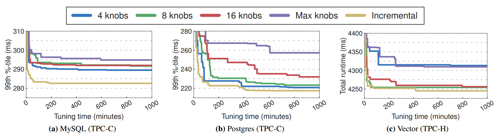

**图5：旋钮数** - 使用由OtterTune生成的仅配置一定数量旋钮的不同配置在调谐会话期间TPC-C和TPC-H的DBMS的性能。

​        **MySQL：**图5a中的结果表明，增量方法使OtterTune能够在大约45分钟内找到适合MySQL的配置。 与Postgres和Vector不同，与固定旋钮设置相比，增量方法为MySQL的调优性能提供了显着的提升。 MySQL的下一个最佳旋钮数设置是固定的四个旋钮。 这四个旋钮包括DBMS的缓冲池和日志文件大小（参见图1a），以及用于将数据刷新到存储的方法。 较大的旋钮计数设置包括控制其他线程策略和预取到缓冲池中的页数的能力。 但根据我们的实验，我们发现这些对静态TPC-C工作负载的性能影响最小。 因此，包括这些影响较小的旋钮会增加模型中的噪音量，从而更难找到重要的旋钮。

​        **Postgres：**图5b中的结果表明，增量方法和固定的四个旋钮设置为OtterTune提供了DBMS性能的最佳提升。与MySQL类似，Postgres有少量旋钮，对性能有很大影响。例如，控制缓冲池大小的旋钮和影响优化器选择查询计划的旋钮都在四个旋钮设置中。较大的固定旋钮设置比四个旋钮设置更差，因为它们包含的附加旋钮对系统的性能影响很小。因此，调整这些不相关的旋钮只会使优化问题更加困难。然而，增量方法被证明是一种强大的DBMS技术，它对TPC-C工作负载的影响较小，因为它略微优于四个旋钮设置。它的性能在400分钟后继续提高，因为它扩大了它检查的旋钮数量。这是因为增量方法允许OtterTune在扩展其范围以考虑其他旋钮之前，为一小组最具影响力的旋钮探索和优化配置空间。

​        **Vector：**如图5c所示，OtterTune通过8,16和增量旋钮设置实现最佳调音性能。 与MySQL和Postgres相比，仅调整四个旋钮并不能提供最佳的调节性能。 这是因为在八个旋钮设置中存在一些Vector更具冲击力的旋钮，而在四个旋钮设置中不存在。 前四个旋钮调整查询执行的并行度，缓冲池的大小和预取选项以及DBMS的SIMD功能。 有一个旋钮用一个策略取代了Vector的标准LRU缓冲区替换算法，该策略利用了长时间运行扫描期间磁盘页面访问模式的可预测性。 由于争用等待互斥锁，此旋钮可能会产生开销。 由于八个旋钮设置始终禁用此旋钮，因此可能会阻止四个旋钮设置实现相当的性能。

​	调整会话的最佳旋钮数因DBMS和工作负载而异，因此无法提供通用旋钮设置。 这些结果表明，随着时间的推移，增加OtterTune考虑的旋钮数量是最佳方法，因为它在复杂性和性能之间取得了适当的平衡。 使用这种方法，OtterTune能够调整像MySQL和Postgres这样有较少关键旋钮的DBMS，以及像Vector那样需要调整更多旋钮才能获得良好性能的DBMS。

### 7.4调整评估

​	我们现在演示如何从以前的调优会话中学习，以提高OtterTune找到良好DBMS旋钮配置的能力。 为了实现这一点，我们将OtterTune与另一个名为iTuned [24]的调整工具进行了比较，该工具也使用高斯过程模型来搜索最佳的DBMS配置。

​	与OtterTune不同，iTuned不使用从先前调整会话收集的数据来训练其GP模型。 它使用随机抽样技术（Latin Hypercube Sampling）生成初始的10个DBMS配置集，这些配置在调优会话开始时执行。 iTuned使用来自这些初始实验的数据来训练GP模型，然后以与第6.2章节中描述的相同方式搜索最佳配置。

​	对于这种比较，我们使用OLTP DBMS（MySQL和Postgres）的TPC-C和Wikipedia基准以及OLAP DBMS（Vector）的TPC-H工作负载的两种变体。 OtterTune使用最后一个工作负载映射阶段确定的最相似工作负载混合的数据来训练其GP模型。 两种调节工具都使用增量旋钮方法来确定每个观察期间要调节的旋钮数量（见第5.3节）。 不同之处在于，iTuned仅在完成初始实验集后才开始使用此方法。

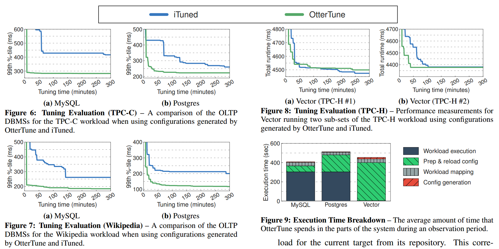

**图6：调整评估（TPC-C）** - 使用OtterTune和iTuned生成的配置时，TPC-C工作负载的OLTP DBMS的比较。

**图7：调整评估（维基百科）** - 使用OtterTune和iTuned生成的配置时，维基百科工作负载的OLTP DBMS的比较。

**图8：调整评估（TPC-H）** - 使用OtterTune和iTuned生成的配置运行TPC-H工作负载的两个子集的Vector的性能测量。

**图9：执行时间细分** - OtterTune在观察期间在系统各部分中花费的平均时间。

​        **TPC-C：**图6中的结果显示，OtterTune和iTuned都在调优会话的早期阶段找到配置，以提高默认配置的性能。但是，有两个关键的区别。首先，OtterTune在MySQL的前30分钟和Postgres的45分钟内找到了更好的配置，而iTuned需要60-120分钟来生成为这些系统提供重大改进的配置。第二个观察结果是OtterTune为此工作负载生成了比iTuned更好的配置。在MySQL的情况下，图6a显示OtterTune的最佳配置比iTuned的延迟降低了85％。使用Postgres，它降低了75％。两种方法都为某些单独的旋钮选择相似的值，但iTuned无法为OtterTune的多个旋钮找到适当的平衡。 OtterTune在平衡这些旋钮方面做得更好，因为它们的GP模型可以更好地理解配置空间，因为它们经过了更多数据的训练。

​        **维基百科：**我们接下来使用更复杂的工作负载比较MySQL和Postgres的两种调优方法。 与TPC-C一样，图7中的结果显示，在维基百科基准测试的前15分钟内，OtterTune的事务延迟与默认配置相同。Postgres在超过100分钟后具有类似的延迟逐渐减少。 我们发现iTuned再次无法在调优会话开始时为最重要的旋钮生成良好的配置，因为它必须填充其初始化集。 总的来说，OtterTune能够为两个DBMS实现更低的延迟。

​        **TPC-H：**在最后一个实验中，我们比较了两个调优工具为在Vector上运行的两个TPC-H工作负载混合生成的配置的性能。 图8显示OtterTune再次产生比iTuned更好的配置，但差异不如OLTP工作负载明显。 原因是Vector不允许调整工具为其旋钮设置的值。 例如，它只允许DBA为其缓冲池大小设置合理的值，否则它将报告错误并拒绝启动。 将此与我们评估的其他DBMS相比较，DBA可以将这些关键旋钮设置为几乎任意值。 因此，调整Vector是比调整MySQL或Postgres更简单的优化任务，因为可能的配置空间更小。

### 7.5执行时间细分

​	为了更好地理解在观察期结束时计算新配置时OtterTune会发生什么，我们检测其调优管理器记录它调整第6章算法的不同部分花费的时间。 我们使用TPC-C用于MySQL和Postgres，使用TPC-H用于Vector。 执行时间的四个类别如下：

- **工作负载执行：**DBMS执行工作负载以收集新指标数据所需的时间。

- **准备和重新加载配置：**OtterTune控制器安装下一个配置并为下一个观察期准备DBMS所需的时间（例如，必要时重新启动）。

- **工作负载映射：**OtterTune的动态映射方案从其存储库中识别当前目标的最相似工作负载所需的时间。 这对应于第6.1章节的第一步。

- **配置生成：**OtterTune的调优管理器计算目标DBMS的下一个配置所用的时间。 这包括梯度下降搜索和GP模型计算。 这是第6.2章节的第2步。

​        图9中的结果显示了OtterTune在调整会话期间花费的平均时间的细分。工作负载执行时间是OtterTune MySQL和Postgres总时间的最大部分。这是预期的，因为这两个DBMS都在5分钟的观察期内执行目标工作负载。相比之下，Vector执行一系列TPC-H查询，平均需要5秒才能完成。这些结果表明，OtterTune的控制器需要62秒才能为每个新配置重启MySQL，而Postgres和Vector分别需要3分钟和6.5分钟重启。 Postgres更长的准备时间是在观察期之间运行vacuum命令以回收过期元组占用的任何存储的结果。对于Vector，准备时间较长，因为必须卸载所有数据，然后在每次重新启动DBMS时将其重新加载到内存中。所有三个DBMS分别在30-40秒和5-15秒之间完成工作负载映射和配置建议步骤。这是因为在OtterTune的存储库中，对于用于在这些步骤中训练模型的每个工作负载，可用的数据量大致相同。

### 7.6功效比较

​	在我们的上一个实验中，我们比较了使用OtterTune选择的最佳配置与人类DBA和开源调优顾问工具选择的最佳配置时MySQL和Postgres的性能。我们还将OtterTune的配置与由云数据库即服务（DBaaS）提供商创建的配置进行比较，这些提供程序是针对MySQL和Postgres定制的，运行在与其他实验相同的EC2实例类型上。 我们在附录B中提供了这些实验的配置。

​	每个DBA都提供了与我们所有实验中相同的EC2设置。 允许他们调整他们想要的任何旋钮但不允许修改DBMS外部的东西（例如OS内核参数）。 在客户端实例上，我们为他们提供了一个脚本，用于执行5分钟观察期的工作负载以及一个完整的日志记录，该日志记录了该工作负载之前执行的查询。 允许DBA根据需要多次重启DBMS或工作负载。

​	对于DBaaS，我们使用为Amazon RDS生成的配置。 我们在这些实验中使用与其他部署相同的实例类型和DBMS版本。 我们最初在RDS管理的DBMS上执行了工作负载，但发现这没有提供公平的比较，因为Amazon不允许您禁用复制设置（这会导致性能下降）。 为了解决这个问题，我们从RDS实例中提取了DBMS配置，并在与其他实验相同的EC2设置上对它们进行了评估。 我们禁用控制复制设置的旋钮与我们的其他实验一致。

​        **MySQL：**我们的第一位DBA是来自立陶宛的首席MySQL调优和优化专家，他拥有超过15年的经验，并在一家知名的互联网公司工作。 他们在20分钟内完成了调节，总共修改了8个旋钮。

​	MySQL调优工具（MySQLTuner [2]）检查OtterTune收集的相同类型的DBMS指标，并使用静态启发式方法来推荐旋钮配置。 它使用迭代方法：我们执行工作负载，然后运行调优脚本。 该脚本发出建议而不是精确设置（例如，将缓冲池大小设置为至少2 GB）。 因此，我们将每个旋钮设置为配置文件中建议的下限，重新启动DBMS，然后重新执行工作负载。 我们重复此操作，直到脚本停止推荐设置以进一步改进配置。 在完成建议之前，这个过程需要45分钟（即8次迭代），并修改了5个旋钮。

​	图10显示，当使用OtterTune生成的最佳配置与TPC-C调优脚本生成的最佳配置时，MySQL的吞吐量提高了约35％，延迟降低了60％。 我们看到调优脚本的配置提供了所有（非默认）配置中最差的性能。 原因是调整脚本只修改四个最有影响力的旋钮之一，即缓冲池的大小。 调整脚本修改的其他旋钮是独立缓冲池的数量和查询缓存设置。 然而，我们发现这些旋钮没有可测量的效果。 这些结果与我们在第7.3章节中的研究结果一致，显示MySQL的大多数性能改进来自调整前四个旋钮。

​	图10中的延迟和吞吐量测量结果表明，与RDS相比，使用OtterTune配置时，MySQL的吞吐量提高了约22％，延迟降低了约57％。 RDS修改了四个最有影响力的旋钮中的三个：缓冲池的大小，日志文件的大小以及用于将数据刷新到磁盘的方法。 尽管如此，我们仍然看到RDS配置的性能仅略高于调优脚本的性能。 一个有趣的发现是，RDS实际上将日志文件（和其他文件）的大小减小到小于MySQL的默认设置。 我们希望选择这些设置来支持部署在可变大小的EBS存储卷上的实例，但是我们还没有找到支持这一点的文档。

​	OtterTune生成的配置几乎与DBA一样好。 DBA配置了与RDS相同的三个顶级旋钮中的三个。 我们看到OtterTune，DBA和RDS更新了一个旋钮，它确定如何将数据刷新到磁盘是相同的选项。 此旋钮的默认设置使用fsync系统调用将所有数据刷新到磁盘。 但是OtterTune，DBA和RDS选择的设置对于这个旋钮更好，因为它在绕过OS缓存读取数据时避免了双缓冲。 DBA和OtterTune都为缓冲池和日志文件选择了类似的大小。 DBA修改了其他设置，比如禁用MySQL的监控工具，但他们还修改了影响MySQL是否确保所有事务在提交时都完全持久的旋钮。 正如在第3.2章节中所讨论的，OtterTune禁止调整此类旋钮。

​        **Postgres：**对于下一个DBMS，我们的人类专家是美国中西部司法法院系统的主要DBA。 他们拥有超过六年的经验，并已调整了100多个复杂的生产数据库部署。 他们在20分钟内完成了调整任务，并修改了总共14个旋钮。

​	Postgres调优工具（PGTune [4]）不像MySQL那样复杂，因为它只使用预先编程的规则来为目标硬件生成旋钮配置，而不考虑DBMS的指标。 但是，我们发现使用Postgres调优工具更容易，因为它基于系统中可用的RAM量以及有关目标工作负载的一些高级特性（例如，OLTP与OLAP）。 生成配置需要30秒，我们不必重新启动DBMS。 它改变了总共八个旋钮。

​	图11b中的延迟测量表明，OtterTune，调优工具，DBA和RDS生成的配置都可以在Postgres的默认设置下实现TPC-C的类似改进。 这可能是因为OLTP-Bench客户端和DBMS之间的网络往返开销。 但是图11中的吞吐量测量表明，与DBA和调优脚本相比，Postgres的OtterTune性能提高了约12％，与RDS相比，性能提高了约32％。

​	与我们的MySQL实验不同，调整方法在它们选择的旋钮和它们为它们选择的设置方面存在相当大的重叠。 所有配置都调整了OtterTune发现影响最大的三个旋钮。 这些旋钮中的第一个是调整缓冲池的大小。 所有配置都将此旋钮的值设置为2-8 GB。 第二个旋钮向优化器提供关于OS和Postgres缓冲区中可用内存总量的“提示”，但实际上并未分配任何内存。 与OtterTune和调整脚本分别选择的18 GB和23 GB的设置相比，DBA和RDS选择10 GB和7 GB的保守设置。 后两者过度提供可用内存量，而DBA和RDS选择的设置更准确。

​	最后一个旋钮控制在检查点之间写入的最大日志文件数。 将此旋钮设置得太低会触发更多检查点，从而导致巨大的性能瓶颈。 增加此旋钮的值可提高I / O性能，但也会增加崩溃后DBMS的恢复时间。 DBA，调整脚本和AWS将此旋钮设置为16到64之间的值。然而，OtterTune将此旋钮设置为540，这不是一个实用值，因为恢复将花费太长时间。 与其他配置相比，OtterTune选择如此高的值的原因是它使用延迟作为其优化指标。 该指标捕获了最小化检查点数量对延迟的积极影响，但没有捕获更长恢复时间的缺点。 我们将此问题作为未来工作的目标。

## 8、相关工作

​	以前关于自动数据库调优的大部分工作都集中在选择数据库的最佳逻辑或物理设计[16,65]，例如选择索引[28,17,59]，分区方案[8,38,41,19] 或物化观点[7]。 物理设计是确定查询将如何访问它的数据配置，而旋钮配置会影响DBMS的内部。

​	其他人则研究调整对性能影响最大的DBMS旋钮子集[49,21,24]。 与物理数据库设计工具不同，配置工具不能使用DBMS的查询优化器的内置成本模型。 此类模型根据系统预期为特定查询执行的工作量生成估计值。 这些估计旨在将单个DBMS的备选查询执行策略与固定执行环境进行比较[44]。 因此，他们无法正确地捕获瓶颈，就像执行并发查询或事务时DBMS的指标一样[63]。

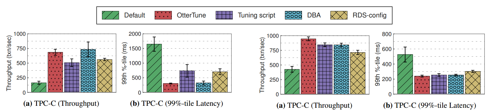

**图10：功效比较（MySQL）** - TPC-C基准测试的吞吐量和延迟测量。使用（1）默认配置，（2）OtterTune配置，（3）调整脚本配置，（4）立陶宛DBA配置，以及（5）Amazon RDS配置。

**图11：功效比较（Postgres）** - TPC-C基准测试的吞吐量和延迟测量。使用（1）默认配置，（2）OtterTune配置，（3）调整脚本配置，（4）专家DBA配置，以及（5）Amazon RDS配置。

​	在2000年代，IBM发布了DB2 Performance Wizard工具，询问DBA关于其应用程序的问题（例如，工作负载是OLTP还是OLAP），然后根据他们的答案提供旋钮设置[34]。 它使用由DB2工程师手动创建的模型，因此可能无法准确反映实际工作负载或操作环境。 IBM后来发布了一个带有自调整内存管理器的DB2版本，该管理器使用启发式方法来确定如何分配DBMS的内存[47,53]。

​	Oracle开发了一个类似的内部监控系统，以识别由于DBMS内部组件中的错误配置而导致的瓶颈[22,33]。 然后，它为DBA提供了可操作的建议来缓解它们。 与IBM的工具一样，Oracle系统采用基于性能测量的启发式方法来管理内存分配，因此无法调整所有可能的旋钮。 Oracle的更高版本包括一个SQL分析器工具，用于估计对DBMS进行修改对性能的影响，例如升级到更新版本或更改系统配置[62,10]。 这种方法也被用于Microsoft的SQL Server [37]。 但对于两个DBMS，使用此工具仍然是一个手动过程：DBA提供他们想要更改的旋钮设置，然后该工具执行实验，无论是否应用该更改。 然后，DBA根据工具报告的结果决定要采取的操作。

​	人们已经使用更自动化的反馈驱动技术来迭代地调整DBMS配置旋钮以最大化某些目标[13,24,60]。 这些工具通常包含一个实验“runner”，它在DBMS中执行工作负载样本或基准测试以检索性能数据。 根据此数据，该工具然后将更改应用于DBMS配置，然后再次重新执行该工作负载以确定性能是否得到改善[61]。 这种情况一直持续到DBA停止该过程或该工具认识到不太可能通过运行更多实验获得额外的性能提升。

​	COMFORT工具使用这种在线反馈方法来解决调整问题，如锁定负载控制[60]。 它采用了一种控制理论技术，可以一次向上或向下调节一个旋钮，但不能发现多个旋钮之间的依赖关系。

​	BerkeleyDB的其他工作使用影响图来模拟配置旋钮之间的概率依赖性[49]。 这种方法使用旋钮的条件独立性来推断特定DBMS配置的预期结果。 然而，问题是这些图必须由领域专家手动创建，因此它们一次只能调整四个旋钮。

​	DBSherlock工具通过比较系统缓慢的DBMS性能时间序列数据中的区域与其正常运行的区域来帮助DBA诊断问题[63]。

​	iTuned工具是与我们的方法相关的最接近的工作[24]。 它使用“循环窃取”策略持续测量更改某些旋钮对系统性能的影响，该策略对DBMS配置进行微小更改，然后在DBMS未充分利用时执行工作负载样本。 它使用高斯过程模型来探索解空间并收敛到接近最优的配置。 初始模型是根据从执行使用自适应采样技术选择的一组实验收集的数据进行训练的。 iTuned工具可能需要长达7个小时才能调整DBMS，而我们的结果则是在第7.4章节中显示OtterTune在不到60分钟内实现了这一目标。

​	另一种技术是使用线性和二次回归模型将旋钮映射到性能[58]。 其他人已经考虑过使用爬山技术来解决这个问题[61]。 然而，这项工作并未涉及如何使用新数据重新训练这些模型，或如何指导实验过程以了解解决方案的新领域。

​	所有这些反馈驱动工具都必须确定哪些配置旋钮可能会提高DBMS的性能和价值范围。 这允许工具执行最少数量的实验，提供整个搜索空间的近似采样[24]。 SARD工具使用一种称为Plackett-Burman设计的技术，根据它们对性能的影响生成DBMS旋钮的相对排名[21]。 其他人已经开发出统计技术，用于推断这些实验如何离散旋钮的潜在值[49]。

## 9、结论

​	我们提出了一种通过重用从先前调整会话收集的训练数据来调整DBMS旋钮配置的技术。 我们的方法使用有监督和无监督的机器学习方法的组合来（1）选择最有影响力的旋钮，（2）将先前未见过的数据库工作负载映射到已知工作负载，以及（3）推荐旋钮设置。 我们的结果表明，OtterTune产生的配置与其他调优顾问生成的默认设置或配置相比，延迟降低了94％。 我们还表明，OtterTune在60分钟内生成的配置与人类专家创建的配置相当。

## 10、参考文献

[1] MySQL – InnoDB startup options and system variables. http://dev.mysql.com/doc/refman/5.6/en/innodb-parameters.html.
[2] MySQL Tuning Primer Script.https://launchpad.net/mysql-tuning-primer.
[3] OLTPBenchmark.com. http://oltpbenchmark.com.
[4] PostgreSQL Configuration Wizard.http://pgfoundry.org/projects/pgtune/.
[5] scikit-learn Documentation – Factor Analysis.http://scikit-learn.org/stable/modules/generated/sklearn.decomposition.FactorAnalysis.html.
[6] scikit-learn Documentation – KMeans. http://scikit-learn.org/stable/modules/generated/sklearn.cluster.KMeans.html.
[7] S. Agrawal, S. Chaudhuri, and V. R. Narasayya. Automated selection of materialized views and indexes in SQL databases. In VLDB, 2000.
[8] S. Agrawal, V. Narasayya, and B. Yang. Integrating vertical and horizontal partitioning into automated physical database design. In SIGMOD, 2004.
[9] J. C. Barrett, D. G. Clayton, P. Concannon, B. Akolkar, J. D.Cooper, H. A. Erlich, C. Julier, G. Morahan, J. Nerup,C. Nierras, et al. Genome-wide association study and meta-analysis find that over 40 loci affect risk of type 1 diabetes. Nature genetics, 41(6):703–707, 2009.
[10] P. Belknap, B. Dageville, K. Dias, and K. Yagoub.Self-tuning for SQL performance in Oracle Database 11g. In ICDE, pages 1694–1700, 2009.
[11] P. Bernstein, M. Brodie, S. Ceri, D. DeWitt, M. Franklin,H. Garcia-Molina, J. Gray, J. Held, J. Hellerstein,
H. Jagadish, et al. The asilomar report on database research.SIGMOD record, 27(4):74–80, 1998.
[12] P. Boncz, T. Neumann, and O. Erling. TPC-H Analyzed:Hidden Messages and Lessons Learned from an Influential Benchmark. 2014.
[13] K. P. Brown, M. J. Carey, and M. Livny. Goal-oriented buffer management revisited. In SIGMOD, pages 353–364, 1996.
[14] G. Casella and R. L. Berger. Statistical Inference. Duxbury advanced series in statistics and decision sciences. Duxbury Press, 2002.
[15] S. Chaudhuri and V. Narasayya. Autoadmin “what-if” index analysis utility. SIGMOD Rec., 27(2):367–378, 1998.
[16] S. Chaudhuri and V. Narasayya. Self-tuning database systems: a decade of progress. In VLDB, pages 3–14, 2007.
[17] S. Chaudhuri and V. R. Narasayya. An efficient cost-driven index selection tool for microsoft SQL server. In VLDB,pages 146–155, 1997.
[18] B. F. Cooper, A. Silberstein, E. Tam, R. Ramakrishnan, and R. Sears. Benchmarking cloud serving systems with ycsb. In SoCC, pages 143–154, 2010.
[19] C. Curino, E. Jones, Y. Zhang, and S. Madden. Schism: a workload-drive approach to database replication and partitioning. In VLDB, 2010.
[20] E. Danna and L. Perron. Structured vs. unstructured large neighborhood search: A case study on job-shop scheduling problems with earliness and tardiness costs. In Principles and Practice of Constraint Programming, volume 2833,pages 817–821, 2003.
[21] B. Debnath, D. Lilja, and M. Mokbel. SARD: A statistical approach for ranking database tuning parameters. In ICDEW,pages 11–18, 2008.
[22] K. Dias, M. Ramacher, U. Shaft, V. Venkataramani, and G. Wood. Automatic performance diagnosis and tuning in oracle. In CIdR, 2005.
[23] D. E. Difallah, A. Pavlo, C. Curino, and P. Cudre-Mauroux.OLTP-Bench: an extensible testbed for benchmarking relational databases. In VLDB, pages 277–288, 2013.
[24] S. Duan, V. Thummala, and S. Babu. Tuning database configuration parameters with iTuned. VLDB, 2:1246–1257,August 2009.
[25] D. Dworin. Data science revealed: A data-driven glimpse into the burgeoning new field. Dec. 2011.
[26] B. Efron, T. Hastie, I. Johnstone, and R. Tibshirani. Least angle regression. The Annals of Statistics, 32(2):407–499,2004.
[27] F. Focacci, F. Laburthe, and A. Lodi. Handbook of Metaheuristics, chapter Local Search and Constraint
Programming. Springer, 2003.
[28] H. Gupta, V. Harinarayan, A. Rajaraman, and J. D. Ullman.Index selection for olap. In ICDE, pages 208–219, 1997.
[29] T. Hastie, R. Tibshirani, and J. Friedman. The Elements of Statistical Learning. Springer, 2001.
[30] A. Jain, M. Murty, and P. Flynn. Data clustering: A review.volume 31, pages 264–323, 1999.
[31] A. K. Jain and R. C. Dubes. Algorithms for clustering data.Prentice-Hall, Inc., 1988.
[32] A. Krause and C. S. Ong. Contextual gaussian process bandit optimization. In NIPS, pages 2447–2455, 2011.
[33] S. Kumar. Oracle Database 10g: The self-managing database, Nov. 2003. White Paper.
[34] E. Kwan, S. Lightstone, A. Storm, and L. Wu. Automatic configuration for IBM DB2 universal database. Technical report, IBM, jan 2002.
[35] D. Laney. 3-D data management: Controlling data volume,velocity and variety. Feb. 2001.
[36] M. Linster. Best practices for becoming an exceptional postgres dba. http://www.enterprisedb.com/best-practices-becoming-exceptional-postgres-dba, Aug.2014.
[37] D. Narayanan, E. Thereska, and A. Ailamaki. Continuous resource monitoring for self-predicting DBMS. In MASCOTS, pages 239–248, 2005.
[38] A. Pavlo, E. P. Jones, and S. Zdonik. On predictive modeling for optimizing transaction execution in parallel OLTP systems. VLDB, 5:85–96, October 2011.
[39] F. Pedregosa, G. Varoquaux, A. Gramfort, V. Michel,B. Thirion, O. Grisel, M. Blondel, P. Prettenhofer, R. Weiss,V. Dubourg, J. Vanderplas, A. Passos, D. Cournapeau,M. Brucher, M. Perrot, and E. Duchesnay. Scikit-learn:Machine learning in Python. Journal of Machine Learning Research, 12:2825–2830, 2011.
[40] D. T. Pham, S. S. Dimov, and C. D. Nguyen. Selection of k in k-means clustering. In IMechE, volume 219, 2005.
[41] J. Rao, C. Zhang, N. Megiddo, and G. Lohman. Automating physical database design in a parallel database. In SIGMOD,pages 558–569, 2002.
[42] C. E. Rasmussen and C. K. Williams. Gaussian Processes for Machine Learning. The MIT Press, 2006.
[43] A. Rosenberg. Improving query performance in data warehouses. Business Intelligence Journal, 11, Jan. 2006.
[44] A. A. Soror, U. F. Minhas, A. Aboulnaga, K. Salem,P. Kokosielis, and S. Kamath. Automatic virtual machine configuration for database workloads. In SIGMOD, pages 953–966, 2008.
[45] N. Srinivas, A. Krause, S. Kakade, and M. Seeger. Gaussian process optimizatioin in the bandit setting: No regret and experimental design. In Proceedings of the 27th International Conference on Machine Learning, 2010.
[46] M. Stonebraker, S. Madden, and P. Dubey. Intel "big data" science and technology center vision and execution plan.SIGMOD Rec., 42(1):44–49, May 2013.
[47] A. J. Storm, C. Garcia-Arellano, S. S. Lightstone, Y. Diao,and M. Surendra. Adaptive self-tuning memory in DB2. In VLDB, pages 1081–1092, 2006.
[48] C. Sugar. Techniques for clustering and classification with applications to medical problems. PhD thesis, Stanford University, 1998.
[49] D. G. Sullivan, M. I. Seltzer, and A. Pfeffer. Using probabilistic reasoning to automate software tuning.
SIGMETRICS, pages 404–405, 2004.
[50] M. A. et al. TensorFlow: Large-Scale Machine Learning on Heterogeneous Distributed Systems. CoRR, abs/1603.04467,2016.
[51] The Transaction Processing Council. TPC-C Benchmark(Revision 5.9.0).http://www.tpc.org/tpcc/spec/tpcc_current.pdf, June 2007.
[52] The Transaction Processing Council. TPC-H Benchmark(Revision 2.16.0).http://www.tpc.org/tpch/spec/tpch2.16.0.pdf, December 2013.
[53] W. Tian, P. Martin, and W. Powley. Techniques for automatically sizing multiple buffer pools in DB2. In
CASCON, pages 294–302, 2003.
[54] R. Tibshirani. Regression shrinkage and selection via the lasso. Journal of the Royal Statistical Society. Series B (Methodological), 58:267–288, 1996.
[55] R. Tibshirani, G. Walther, and T. Hastie. Estimating the number of clusters in a data set via the gap statistic. Journal of the Royal Statistical Society. Series B (Statistical Methodology), 63:411–423, 2001.
[56] R. J. Tibshirani, A. Rinaldo, R. Tibshirani, and L. Wasserman. Uniform asymptotic inference and the
bootstrap after model selection. arXiv preprint arXiv:1506.06266, 2015.
[57] R. J. Tibshirani, J. Taylor, R. Lockhart, and R. Tibshirani. Exact post-selection inference for sequential regression procedures. arXiv preprint arXiv:1401.3889, 2014.
[58] D. N. Tran, P. C. Huynh, Y. C. Tay, and A. K. H. Tung. A new approach to dynamic self-tuning of database buffers. Trans. Storage, 4(1):3:1–3:25, May 2008.
[59] G. Valentin, M. Zuliani, D. Zilio, G. Lohman, and A. Skelley. DB2 advisor: an optimizer smart enough to
recommend its own indexes. In ICDE, pages 101–110, 2000.
[60] G. Weikum, C. Hasse, A. Mönkeberg, and P. Zabback. The COMFORT automatic tuning project. Information Systems,19(5):381–432, July 1994.
[61] B. Xi, Z. Liu, M. Raghavachari, C. H. Xia, and L. Zhang. A smart hill-climbing algorithm for application server configuration. In WWW, pages 287–296, 2004.
[62] K. Yagoub, P. Belknap, B. Dageville, K. Dias, S. Joshi, and H. Yu. Oracle’s sql performance analyzer. IEEE Data Engineering Bulletin, 31(1), 2008.
[63] D. Y. Yoon, N. Niu, and B. Mozafari. DBSherlock: a performance diagnostic tool for transactional databases. In SIGMOD, pages 1599–1614, 2016.
[64] C. Zhang, A. Kumar, and C. Ré. Materialization optimizations for feature selection workloads. In SIGMOD,pages 265–276, 2014.
[65] D. C. Zilio. Physical Database Design Decision Algorithms and Concurrent Reorganization for Parallel Database Systems. PhD thesis, University of Toronto, 1998.

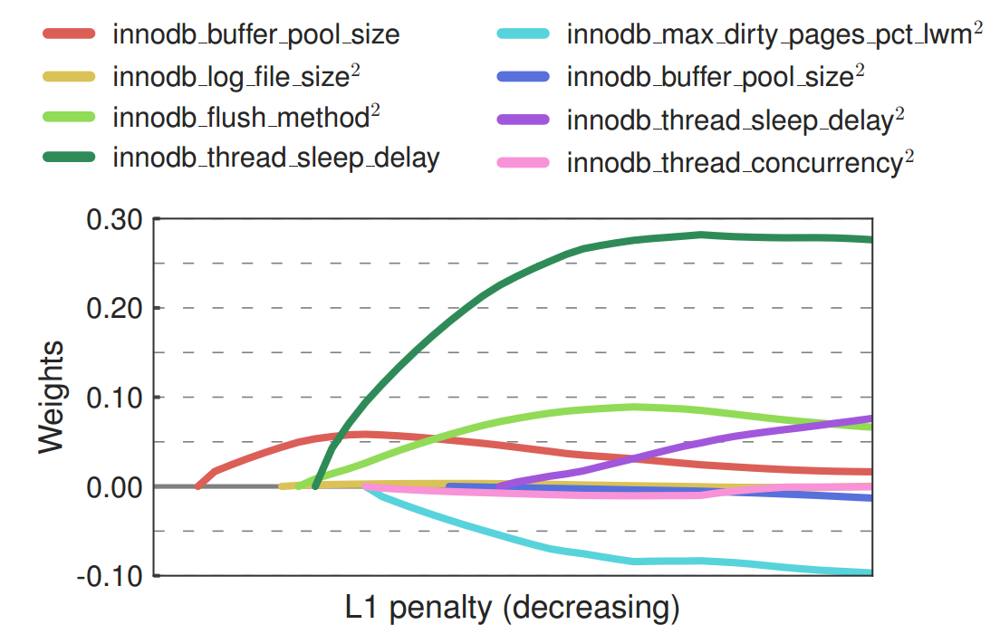

**图12：Lasso Path（MySQL）**

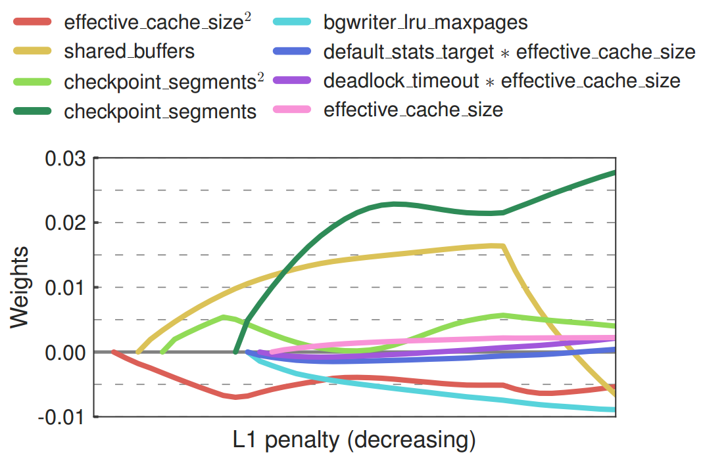

**图13: Lasso Path (Postgres)**

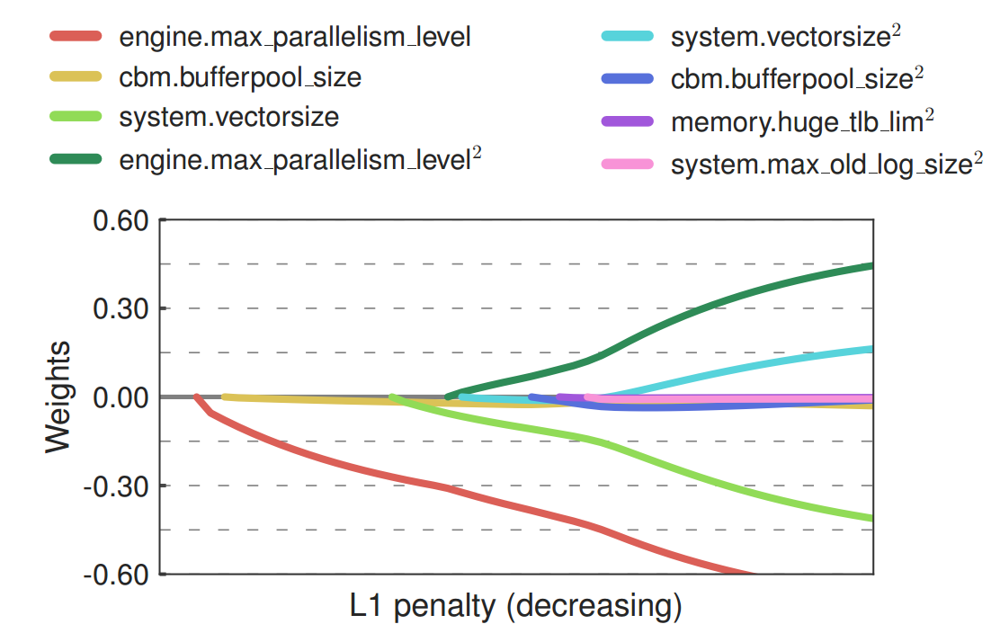

**图14: Lasso Path (Vector)**

## 附录

### A.识别重要的KNOBS

​	本节扩展了对第5.1章节中提出的Lasso路径算法的讨论。结果见图2和3。 图12至14分别显示了针对MySQL，Postgres和Vector的第99百分位延迟计算的Lasso路径。 为清楚起见，我们仅显示这些结果中最具影响力的八个特征。 每条曲线代表回归模型权重向量的不同特征。 这些图通过将它们绘制为L1惩罚的函数来显示这些权重的路径。 权重在回归中出现的顺序表示相应的旋钮（或旋钮的功能）对第99百分位延迟的影响有多大。OtterTune使用将旋钮从最重要到最不重要的排序。

​	如第5.2章节中所述，OtterTune包含二次多项式特征，以提高其回归模型的准确性。 由线性特征的二阶多项式展开产生的两种类型的特征是两个不同的旋钮或相同的旋钮的产物。 第一种类型可用于检测非独立的旋钮对。 例如，图13显示控制查询优化器各方面的两个旋钮之间存在依赖关系：default_statistics_target和effective_cache_size。

​	第二种类型揭示了旋钮和目标度量之间是否存在二次关系。 当我们说关系是“二次”时，我们并不是说它是一个精确的二次方，而是它表现出一些非线性。 如果旋钮的线性和二次项都出现在同一时间的回归中，那么它与目标度量的关系可能是二次的。但是，如果旋钮的线性项出现在回归中的时间远早于二次项，则该关系几乎是线性的。 DBMS共有的一个旋钮是缓冲池的大小。 图12至14显示出，如所预期的，缓冲池大小旋钮和等待时间之间的关系对于所有DBMS是二次的（Postgres旋钮的二次项未显示，但是它是进入回归的第13个）。

### B.效率比较

​	本节是第7.6章节的扩展。我们提供由OtterTune生成的DBMS配置，DBA，调优脚本和评估中使用的Amazon AWS。 表1和表2分别显示了在MySQL和Postgres上运行的TPC-C工作负载的配置。 对于OtterTune生成的配置，表格仅显示10个最有影响力的旋钮，这些旋钮按重要性排序。 对于其他所有配置，旋钮以字典顺序显示。

### C.未来的工作

​	在这一系列工作中仍有一些重要问题尚未解决。 最重要的是我们希望OtterTune能够自动检测目标DBMS的硬件功能。 这很棘手，因为它只能通过远程访问DBMS的主机来实现。 这种限制是必要的，因为这种访问不可用的数据库即服务部署很普遍。 一种方法可能是OtterTune在开始工作负载映射步骤之前执行微基准测试，这将分别强调DBMS中的不同资源。

​	我们计划探索的另一个问题是如何调整本文中描述的自动调整技术来优化数据库的物理设计。 特别是，我们有兴趣利用先前调整的数据来加速调整新应用程序的过程。 与调整DBMS配置类似，调整物理设计变得越来越复杂，以至于能够降低问题复杂性的技术变得越来越必要。

### D.致谢

​	该研究由美国国家科学基金会（III-1423210），国家科学基金会研究生研究奖学金计划（DGE-1252522）和AWS Cloud Credits for Research资助（部分）。

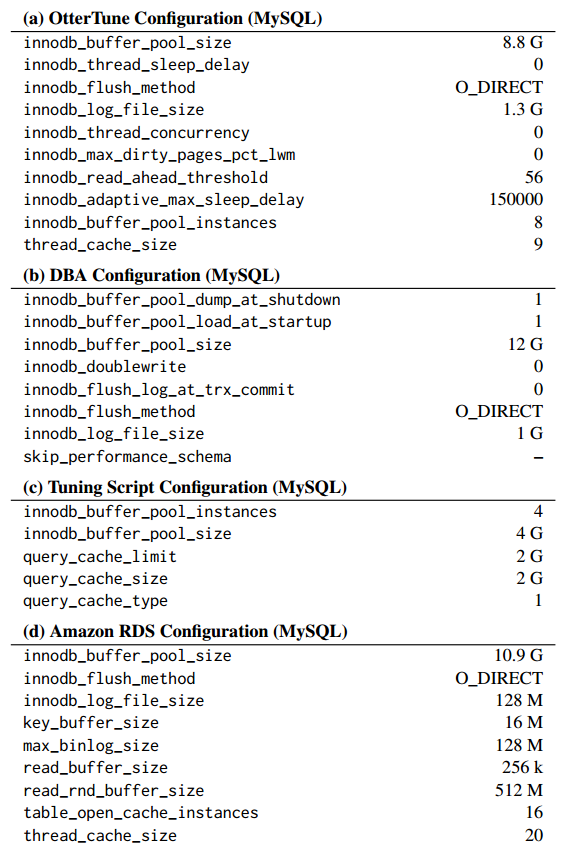

**表1：DBMS配置（MySQL）** - 由（a）OtterTune，（b）DBA，（c）调整脚本和（d）Amazon RDS生成的在MySQL上运行的TPC-C工作负载的最佳配置。

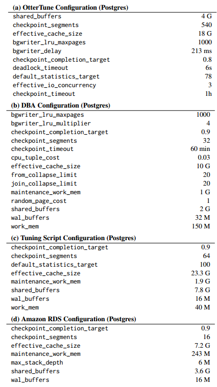

**表2：DBMS配置（Postgres）** - 在（a）OtterTune，（b）DBA，（c）调整脚本和（d）Amazon RDS生成的Postgres上运行的TPC-C工作负载的最佳配置。